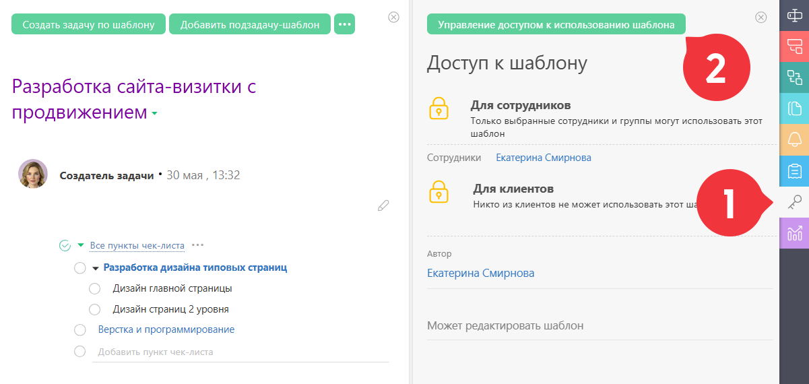

По умолчанию, доступ к созданному [ шаблону задачи](Шаблоны_задач.md "Шаблоны задач") имеет только его автор. Для того, чтобы другие пользователи тоже могли создавать задачи по этому шаблону, им необходимо предоставить доступ к этому шаблону. Для этого в шаблоне необходимо открыть вкладку “Права доступа”. В ней отображены текущие права доступа к этому шаблону для различных категорий пользователей: 

  

Там же есть возможность изменить доступ. Права доступа может менять автор шаблона, а также его руководители и администратор аккаунта.
