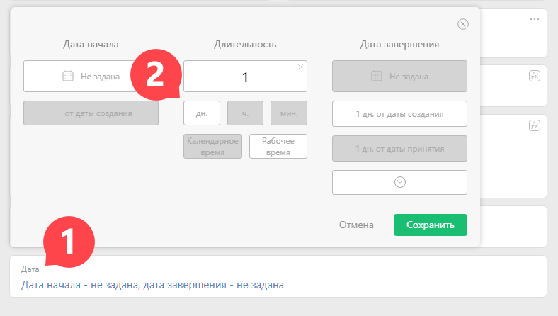
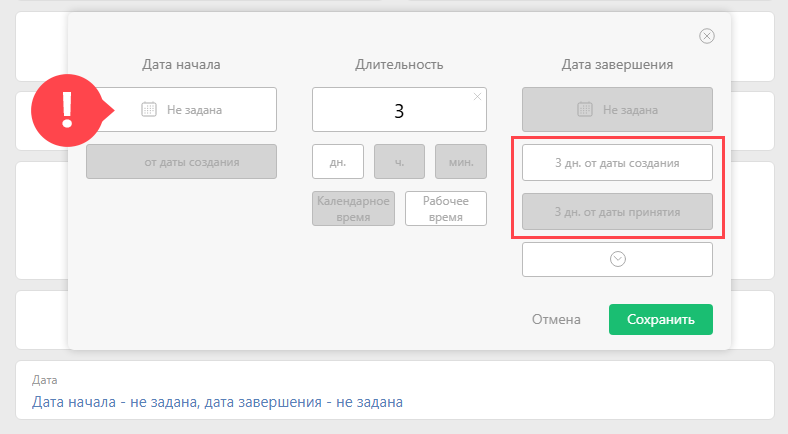
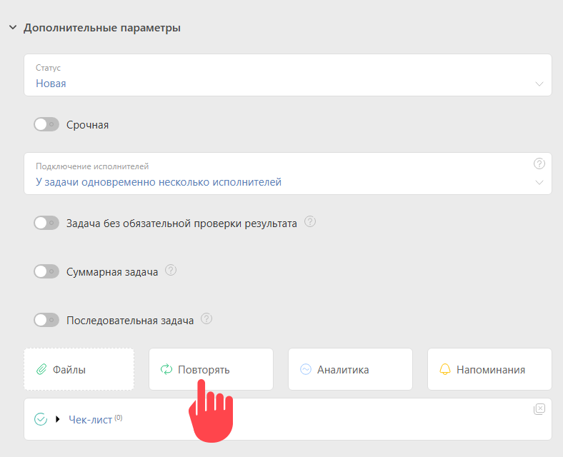
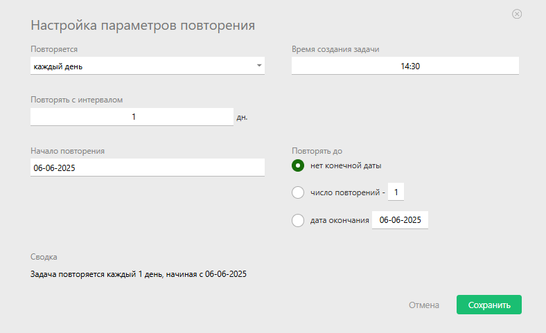

Этот пример показывает, как создать [повторяющуюся задачу](Повторяющиеся_задачи.md "Повторяющиеся задачи"), которая будет создаваться каждый день и при этом должна быть выполнена исполнителем в течение этого же дня. 

## Создаем шаблон повторяющейся задачи

  * Переходим в раздел "Задачи".

  * На панели слева открываем раздел "Повторяющиеся".

  * Нажимаем кнопку "Новый шаблон задачи".

  * Настраиваем поля шаблона, как нам надо.

## Задаем сроки

  * В поле "Дата" указываем длительность 1 день:

## Обратите внимание

Есть несколько вариантов задания сроков выполнения задачи в шаблоне: 

  * Можно привязываться к дате создания задачи, дата завершения задачи рассчитывается как "дата создания + длительность".

  * Можно привязываться к дате принятия исполнителем, дата завершения рассчитывается как "дата принятия исполнителем задачи в работу + длительность".

  * Можно привязываться к дате начала задачи, тогда дата завершения задачи рассчитывается как "дате планируемого начала задачи + длительность".

## Важно

Блоки "Дата создания" и "Дата принятия" работают только для случая, когда дата начала не задана: 

  

Важно учесть, что при заданной длительности в задаче система оперирует [рабочим графиком](Рабочий_календарь.md "Рабочий календарь") исполнителя задачи, заданным в его карточке. 

  

## Задание даты, когда задача должна создаться

Когда задача должна создаться задается в окне повторения задачи: 

  

В появившемся окне задайте условия когда задача будет создаваться: 

  

В представленном примере задача будет создаваться ежедневно в 14:30 по рабочему графику исполнителя, начиная с даты 06-06-2025.
