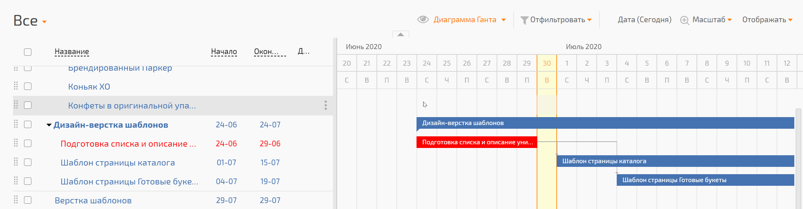
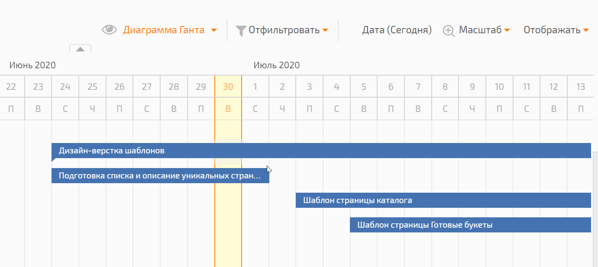
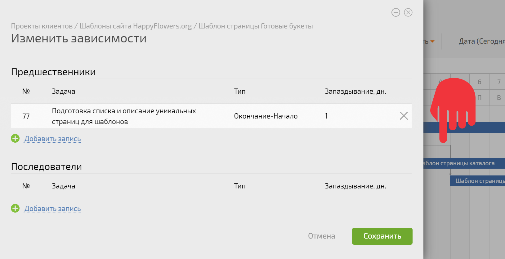
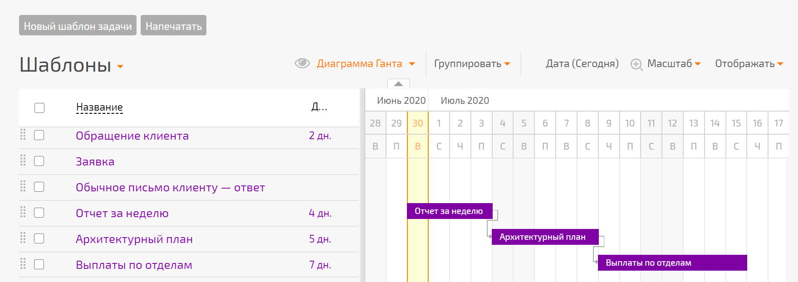
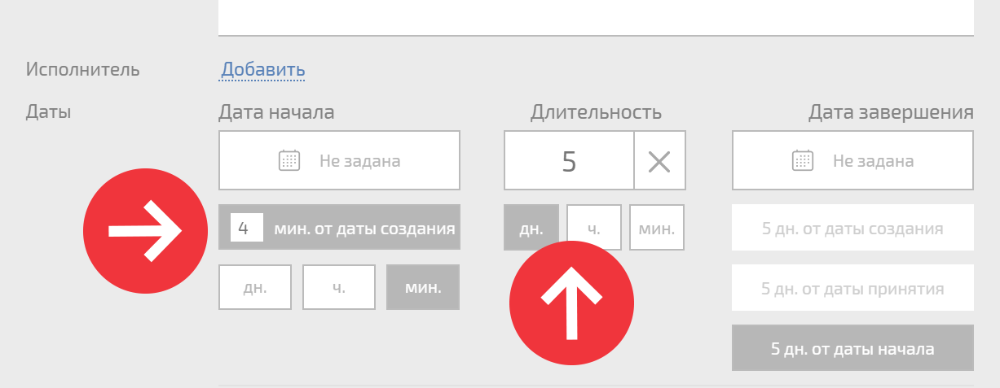

## Задание связей на диаграмме

Вы можете изменять сроки задач и подзадач (тем самым и длительность) на самой [ диаграмме Ганта](Диаграмма_Ганта.md "Диаграмма Ганта"), для этого просто перетаскивайте мышью ползунки, соответствующие дате старта и завершения: 

  

Клик по задаче на диаграмме Ганта вызывает стандартное диалоговое окно для изменения сроков и длительности задачи: 

  

При помощи диаграммы Ганта можно быстро установить связи между задачами или изменить уже существующие. Чтобы задать связи между задачами нужно ухватиться за соответствующий ползунок у задачи и тянуть его к другой задаче, с которой хотим установить связь, при этом в задачах сразу установятся связи нужного вида (Окончание-Начало, Начало-Начало, Начало-Окончание или Окончание-Окончание). На диаграмме связь представленна в виде ломанной со стрелкой, указывающей на направление связи: 

  

Клик по такой линии связи открывает настройки связей задачи, к которой приводит эта связь, где вы сможете увидеть (при необходимости отредактировать или удалить) задачи-предшественники и последователи и заданные для них типы связей: 

  

## Диаграмма Ганта в шаблонах задач

В диаграмме Ганта можно задать связи между шаблонами задач: 

  

**Важно:**

  * чтобы увидеть шаблоны на диаграмме, в шаблоне должны быть указаны даты создания и продолжительность задачи:

    

  

  * При создании проекта по шаблону, содержащему связанные задачи, они будут созданы с такими же связями, которые были прописаны в шаблонах этих задач

  * При создании задачи по отдельному шаблону задачи, связанные с ней задачи созданы не будут. Для того, чтобы связанные задачи были созданы, они должны иметь общую надзадачу (шаблон) - тогда при создании задачи по этому шаблону надзадачи, будет создано дерево ее подзадач, и все они будут связаны так, как это прописано в их шаблонах.
