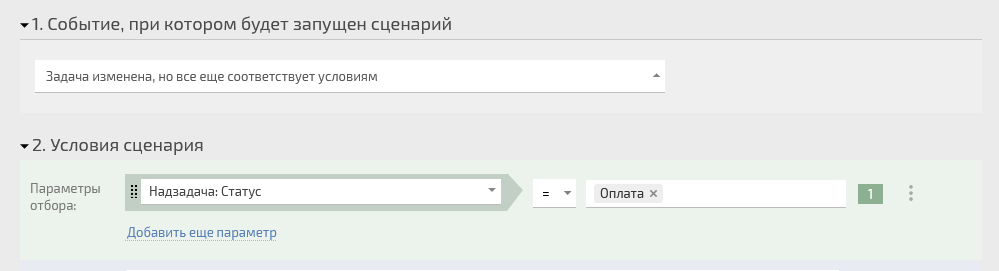

[ Автоматический сценарий](Автоматические_сценарии.md "Автоматические сценарии") с событием **Задача изменена, но все еще соответствует условиям** работает следующим образом: 

  * в момент любого изменения задачи система для каждого условия сценария проверяет, выполняются ли они на текущий момент;

  * если все условия выполняются, сценарий срабатывает и выполняются добавленные в него операции.

  

## Важно

  * Для ожидаемого срабатывания сценария необходимо одновременное сочетание двух факторов: **задача изменена** и **условия в задаче выполняются**. Если эти два фактора разнесены по времени, вы можете получить срабатывания сценария не в тот момент, который ожидаете. Например, в таком сочетании условий:

    

    

  * если статус в надзадаче изменится на "Оплата", то сценарий не сработает, т.к. сама наша задача не изменилась.

  * при этом когда в задаче произойдет любое изменение, сценарий сработает, т.к. присутствуют оба фактора - задача изменилась и условие "Статус надзадачи = Оплата" выполняется.

    Поэтому не рекомендуется использовать в сценариях на событие "Задача изменена, но все еще соответствует условиям" условия, не относящиеся к полям данной задачи. Например, условия по полям надзадачи, полям контрагента или системных признаков вроде "Событие вызвано другим сценарием".
