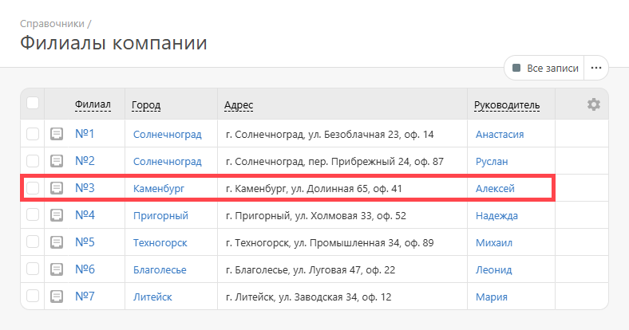
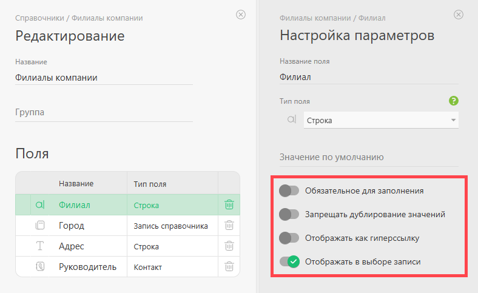
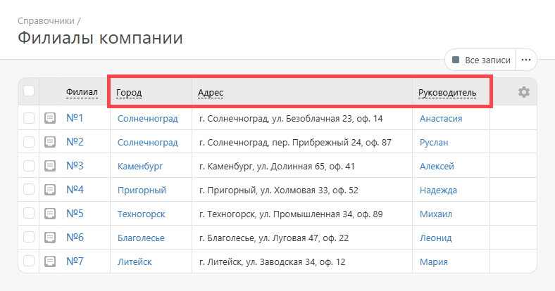
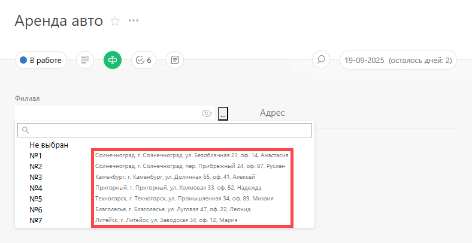
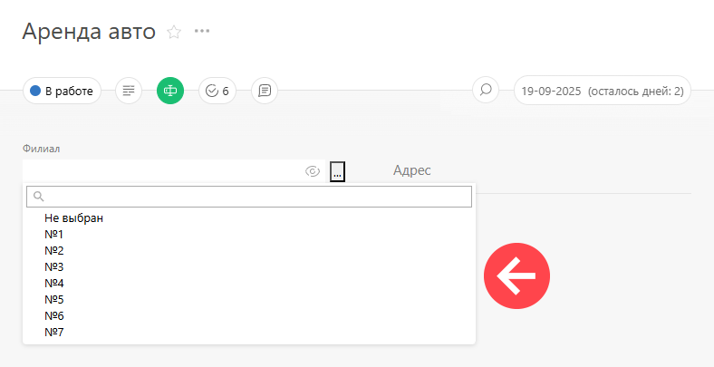
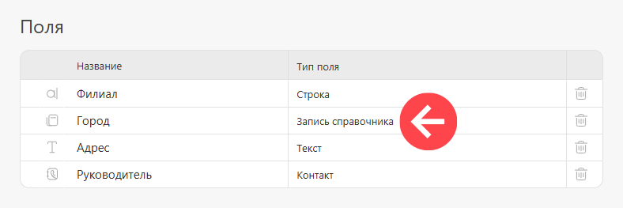
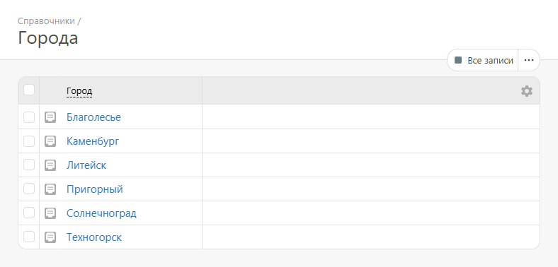
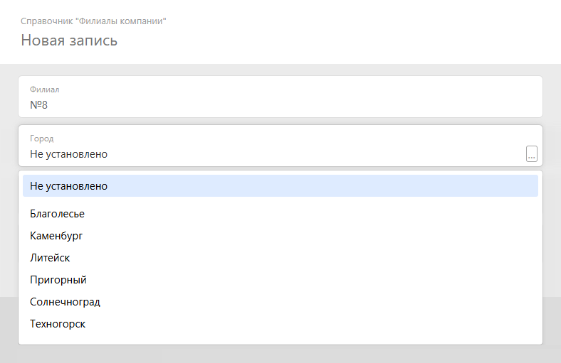
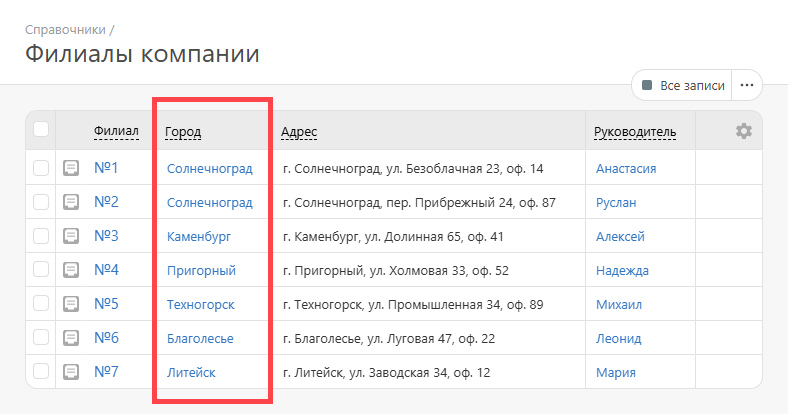

Для накопления и использования разнообразной информации в ПланФиксе существуют [Справочники](Справочники.md "Справочники"). Справочник состоит из записей. **Запись справочника** — это набор полей разного [типа](Типы_пользовательских_полей.md "Типы пользовательских полей"): 

  

Поля записи в справочнике обладают следующими параметрами: 

  

  * **Обязательное для заполнения** — не даст сохранить запись справочника, пока это поле не содержит значение.

  * **Запрещать дублирование значений** — не даст сохранить запись справочника, если в нем уже есть такое значение для данного поля.

  * **Отображать как гиперссылку** — позволяет поля справочника типа «Текст» отображать в виде гиперссылки.

  * **Отображать в выборе записи** — позволяет выбрать дополнительные поля справочника для отображения. Например, при активированном параметре эти поля:

    

  

    Будут отображены при выборе значений справочника:

    

  

    Если же настройку не активировать, выбор значений справочника будет выглядеть так:

    

  

## Важно

  * В ПланФиксе есть тип [пользовательского поля «Запись справочника»](Запись_справочника_-_Тип_поля.md "Запись справочника - Тип поля"), который позволяет хранить ссылки на запись справочника ПланФикса. Обычно такой тип поля используется в задачах, контактах, проектах и самих справочниках.

  * Запись справочника может содержать в том числе и поля типа «Запись справочника» — это позволяет связывать справочники между собой.

Например в справочнике «Филиалы компании» поле «Город» — это поле типа «Запись справочника», содержащее ссылку на значение из другого справочника: 

  

Другой справочник «Города»: 

  

Так выглядит добавление в справочник новой записи с пользовательским полем типа «Запись справочника»: 

  

Итоговый результат: 

