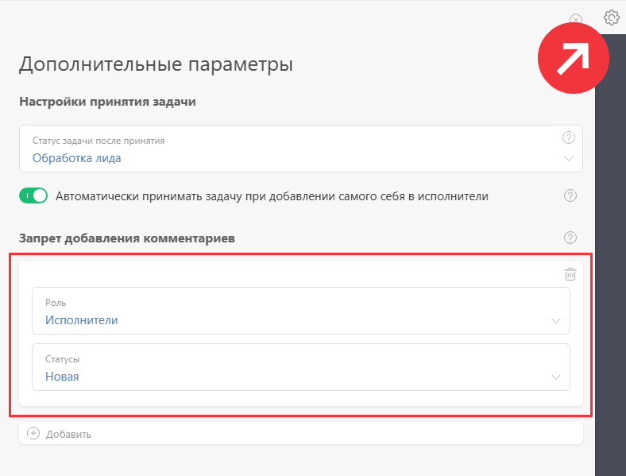
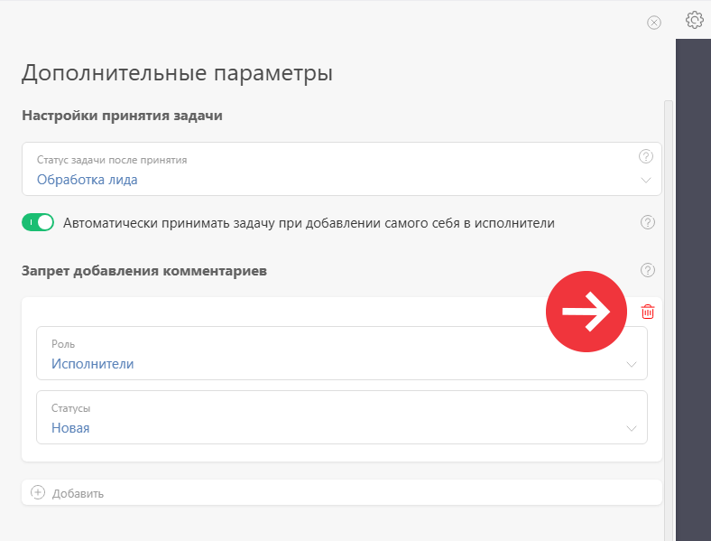
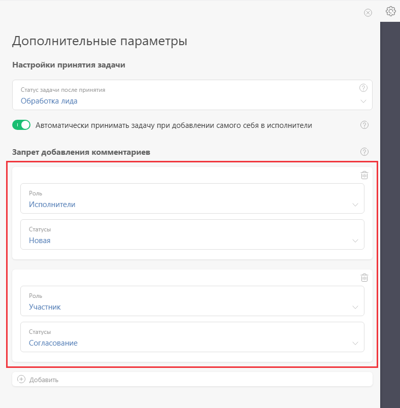

В настройках по умолчанию, исполнитель не может добавить комментарий в [ задачу](Задачи.md "Задачи"), которая находится в [ статусе "Новая"](Новая__(статус_задачи_.md) "Новая \(статус задачи\)") до нажатия на [ кнопку "Принять"](Кнопки_Принять_и_Отклонить.md "Кнопки Принять и Отклонить"): 

  

Этим поведением управляет специальная настройка, которая расположена в нижней части окна [ дополнительных параметров набора статусов](Дополнительные_параметры_набора_статусов.md "Дополнительные параметры набора статусов"): 

  

Если вы хотите разрешить добавление комментариев в задачах, находящихся в статусе "Новая", удалите этот запрет: 

  

Вы можете добавить любое количество запретов на добавление комментариев в задаче, находящейся в определенном статусе. Для каждого запрета выбирается [Роли в задаче | роль пользователей в задаче](Задачи.md "Задачи"), на которую он распространяется, и статус задачи, в котором пользователям, находящимся в этой роли, запрещено добавлять комментарии: 

  

## Полезно

  * Для каждого [ Объекта](Объекты.md "Объекты") существует свой набор статусов, поэтому вы можете управлять этими запретами на уровне конкретного Объекта.
