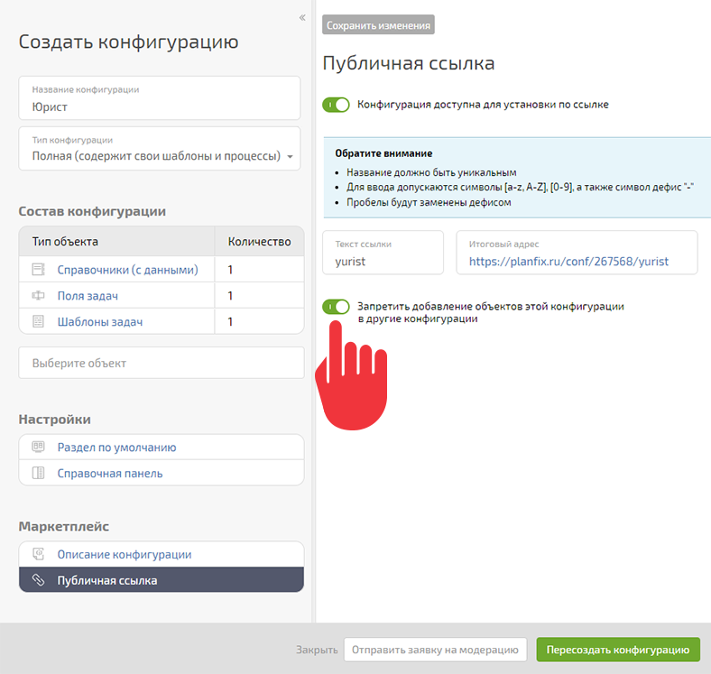

Чтобы защитить свою конфигурацию от копирования из аккаунта, в котором она установлена, можно запретить добавление входящих в нее объектов в другие конфигурации: 

  

## Важно

Этот способ не дает полноценной защиты от копирования объектов конфигурации, так как теоретически можно создать аналогичные объекты с теми же свойствами вручную. Однако распространение конфигурации без согласия автора существенно усложняется.
