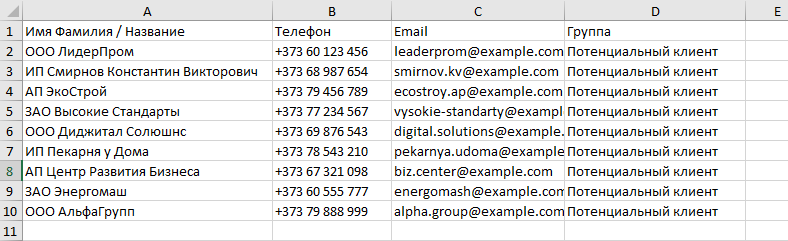
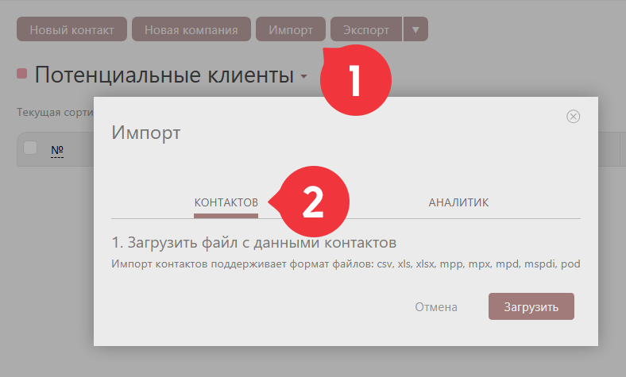
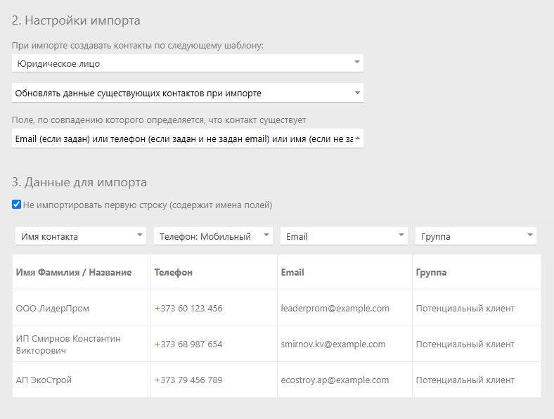
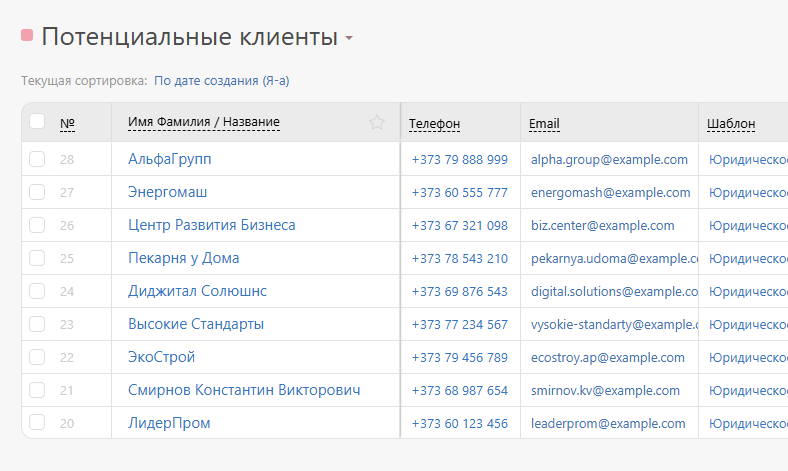

Импорт позволяет загружать в конфигурацию данные клиентов из других источников, а также обновлять их. С общими правилами импорта контактов в ПланФикс можно ознакомиться в [справке](Импорт_контактов.md "Импорт контактов"). 

## Важно

При импорте контактов в конфигурацию **CRM: Управление сделками 3.0** важно учесть некоторые дополнительные параметры. Например, если вы хотите загрузить в ПланФикс список потенциальных клиентов из другого источника сделайте следующее. 

## Процесс импорта клиентов в конфигурацию

  * Выберете в меню раздел **Клиенты** — **Потенциальные клиенты**.

  * Нажмите кнопку **Импорт**.

  * В появившемся окне укажите **Контактов** и загрузите файл (заранее подготовленный) с потенциальными клиентами в ПланФикс:

  

  * Настройте процесс импорта, как указано на картинке ниже:

  

  * Информация о потенциальных клиентах успешно загружена в ПланФикс и добавлена в нужный фильтр контактов:

