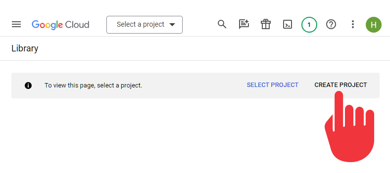
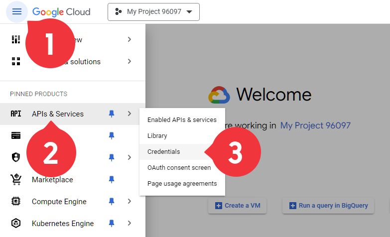
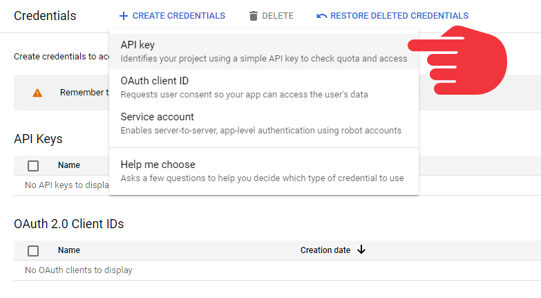
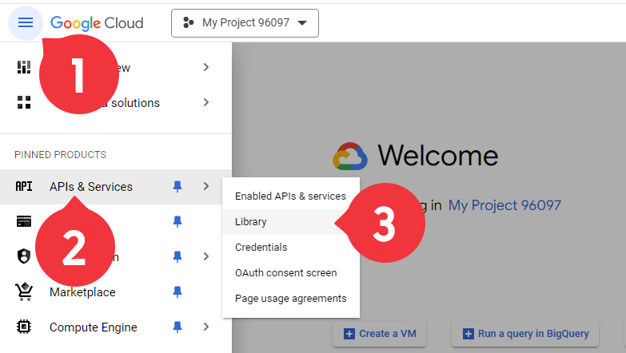
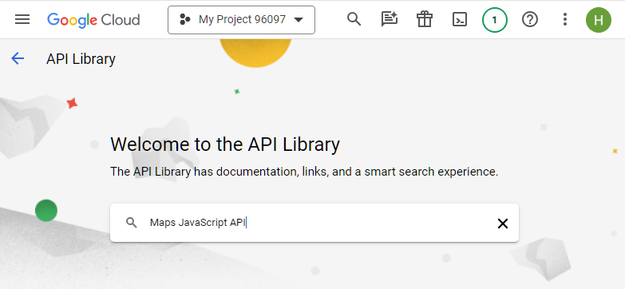
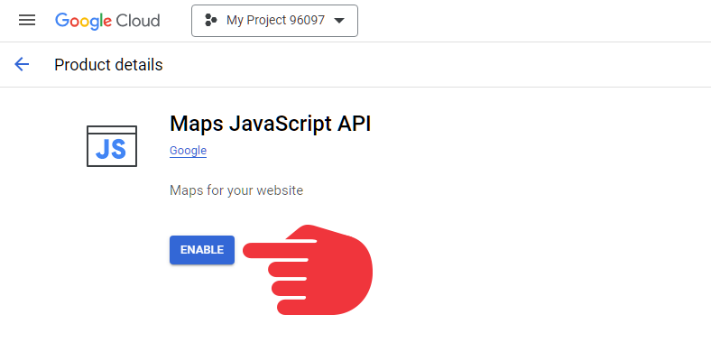

API Google Maps используется для перевода данных, содержащих адреса или названия объектов, из текстового вида в вид, предназначенный для отображения объекта на карте. Эта возможность используется в [ интеграции ПланФикса с картами](Интеграция_с_картами.md "Интеграция с картами"). 

Для подключения вам необходимо иметь (или зарегистрировать новую) учетную запись Google. 

  

## Шаг 1. Подключение API Google Maps

  * Для старта подключения перейдите по [ссылке](https://console.developers.google.com/project/_/apiui/apis/library).

  * Создайте проект:

  

  * В главном меню (открывается по клику на "гамбургер" в верхнем левом углу) выберите **API и Сервисы** — **Учетные данные** :

  

  * Нажмите **Создать учетные данные** и выберите пункт **Ключ API** :

  

  * Скопируйте полученный ключ API. Он необходим для подключения [ интеграции с картами](Интеграция_с_картами.md "Интеграция с картами") в ПланФиксе.

## Шаг 2. Настройка платежного аккаунта

Для работы интеграции необходимо подключить к созданному проекту платежный аккаунт Google. Если у вас нет платежного аккаунта, вы можете создать новый, следуя этой [инструкции](https://cloud.google.com/billing/docs/how-to/create-billing-account). 

Обратите внимание, в данный момент компания Google не регистрирует новых пользователей Google Cloud в России. В этой связи невозможно выбрать страну «Россия» в настройках платёжного аккаунта.

  

На момент написания этой статьи, Google предлагает при подключении бонус в 300USD на 1 год использования любых сервисов Google Cloud Platform. Для этого достаточно создать новый платежный аккаунт и ввести данные кредитной карты. Автоматические платежи с карты не производятся, она служит для идентификации клиента Googlе. 

Cозданный платежный аккаунт должен быть привязан к созданному ранее проекту. 

## Шаг 3. Подключение библиотек

Для корректной работы интеграции вам необходимо подключить следующие API из библиотеки API Google: 

  * Maps JavaScript API;

  * Geocoding API (для преобразования адреса в координаты);

  * Geolocation API (для определения местоположения);

  * Places API (для подсказок при вводе адреса в поле).

  * Directions API (для построения маршрутов).

  

Для подключения перейдите в главном меню ("бутерброд") в раздел **API и Cервисы** — **Библиотека** : 

  

  * Вставьте в поиск название нужного API (скопируйте его из списка выше):

  

  * Кликните в блок найденного API и нажмите **Включить** :

  

  * Повторите эту операцию для каждого из API из списка выше.

  

После включения всех необходимых API, можно переходить к включению [ интеграции с картами](Интеграция_с_картами.md "Интеграция с картами") в интерфейсе ПланФикса. 

  

**Внимание:** Если при попытке ввести адрес в поле типа Местоположение вы наблюдаете информационные сообщения на красном фоне по поводу исчерпания лимитов API, проверьте привязку созданного на Шаге 2 платежного аккаунта к созданному на Шаге 1 проекту.
