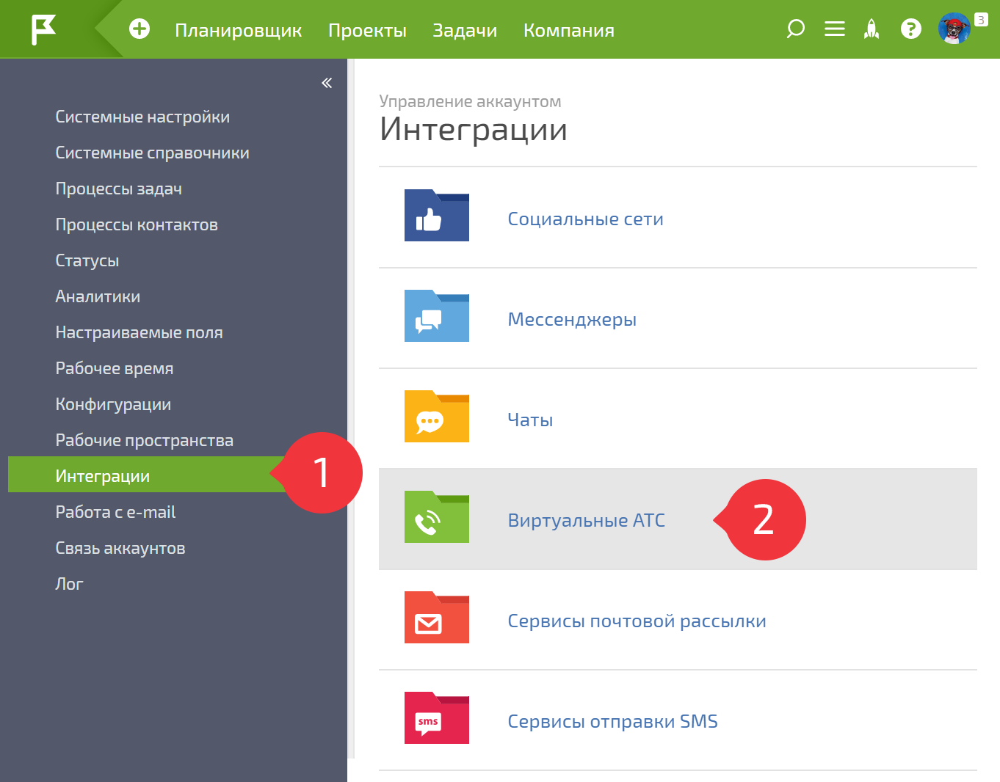
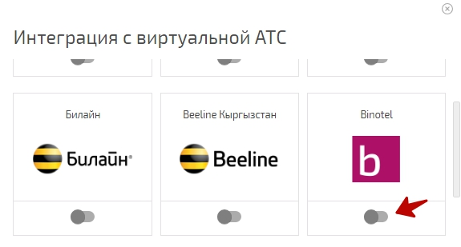
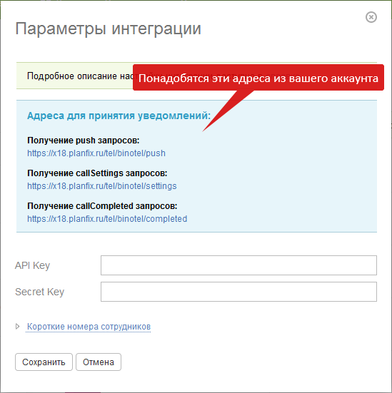
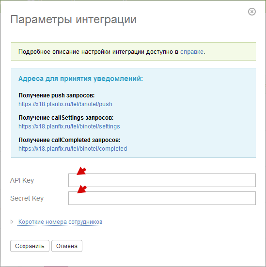

Для настройки интеграции с [виртуальной АТС Binotel](http://www.binotel.ua/): 

1\. Перейдите в раздел **Управление аккаунтом / Интеграции** (доступен владельцу или администратору аккаунта) и нажмите на **Виртуальные АТС** : 

  

  

в появившемся списке нажмите **Активировать** напротив Binotel: 

  

  

**2\. Напишите письмо в службу поддержки Binotel** (support@binotel.ua) следующего содержания: 

Здравствуйте. 

Наша компания настраивает интеграцию вашего сервиса с ПланФиксом. Нам необходимо, чтобы вы: 

**1\. Установили для нас следующие адреса для принятия уведомлений** : 

Получение push запросов: https://имя_аккаунта.planfix.ru/tel/binotel/push 

Получение callSettings запросов: https://имя_аккаунта.planfix.ru/tel/binotel/settings 

Получение callCompleted запросов: https://имя_аккаунта.planfix.ru/tel/binotel/completed 

**2\. И выдали нам ключи для запросов по REST API.**

Запросы будут приходить со стандартных адресов системы ПланФикс. 

Спасибо! 

  

Адреса для первого пункта письма скопируйте в параметрах интеграции в ПланФиксе: 

  

**Примечание:** Служба поддержки Binotel может попросить вас указать IP-адреса, с которых будут приходить запросы. На это нужно ответить, что это стандартные адреса системы ПланФикс - они у них есть, это должно снять вопрос. 

  

**3\. Полученные в ответе от техподдержки ключи укажите в параметрах интеграции в ПланФиксе:**

и сохраните настройки. 

  

## Сохранение данных коллтрекинга

При использовании коллтрекинга Binotel возможно сохранение его данных в аналитику звонков в ПланФиксе. 

Для этого измените аналитику Звонок (и Пропущенный звонок, если необходимо) и добавьте в неё следующие поля типа Строка (можно только необходимые из них): 

  * id - Call Tracking id

  * gaClientId - Google Analytics Client ID

  * gaTrackingId - идентификатор отслеживания сайта в Google Analytics

  * utm_source - метка utm_source

  * utm_medium - метка utm_medium

  * utm_campaign - метка utm_campaign

  * utm_content - метка utm_content

  * utm_term - метка utm_term

  * ipAddress - IP адрес клиента

  * geoipCountry - страна по geoip

  * geoipRegion - регион по geoip

  * geoipCity - город по geoip

  * geoipOrg - организация по geoip

  * domain - сайт

  * timeSpentOnSiteBeforeMakeCall - пребывания на сайте до совершения звонка в секундах

  * firstVisitAt - клиент зашел на сайт впервые

  * disposition - статус звонка

  * generalCallID - id звонка

  * fullUrl - url страницы

## Важно

  * Wire-номер указывайте у сотрудника, в качестве обычного телефонного номера, а не короткого.
