[ПланФикс](https://planfix.ru/) позволяет вести переписку с клиентами, которые пишут личные сообщения и комментарии на вашей [корпоративной странице Facebook](https://www.facebook.com/business/help/148723649153231), прямо из ПланФикса. 

Интеграция использует официальный API Facebook. 

  

## Настройка интеграции

Настроить интеграцию может администратор аккаунта ПланФикса в разделе **Управление аккаунтом** , вкладка **Интеграции - Социальные сети** : 

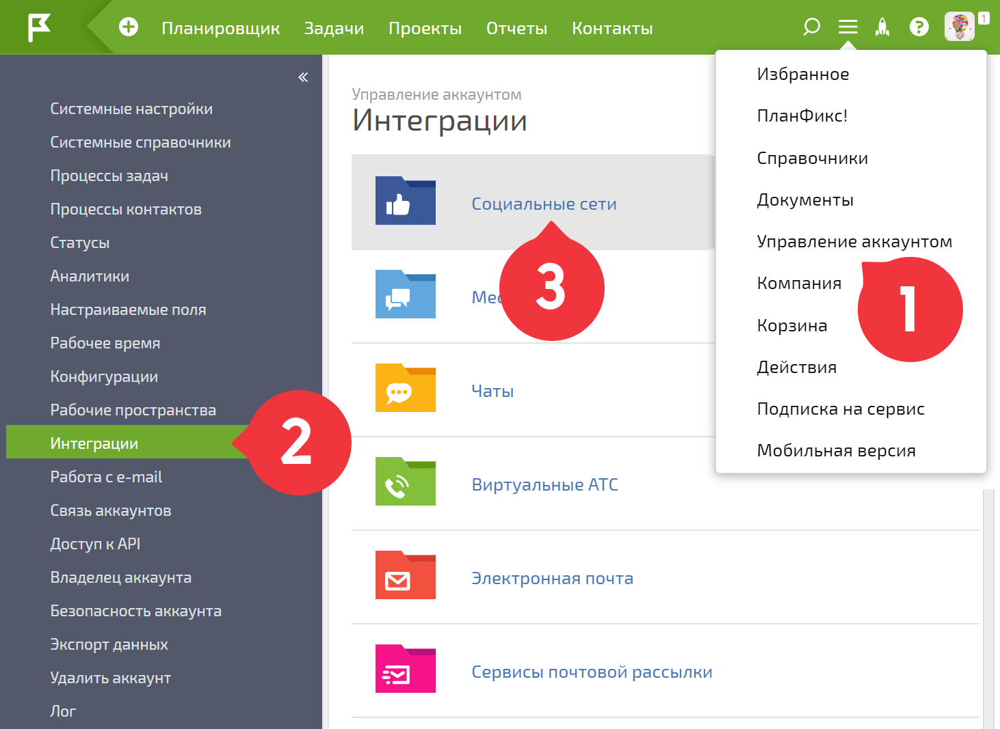

  

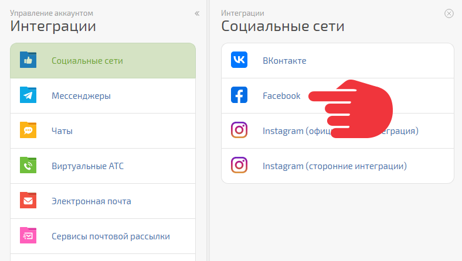

  

Для добавления интеграции нажмите кнопку **Добавить страницу** : 

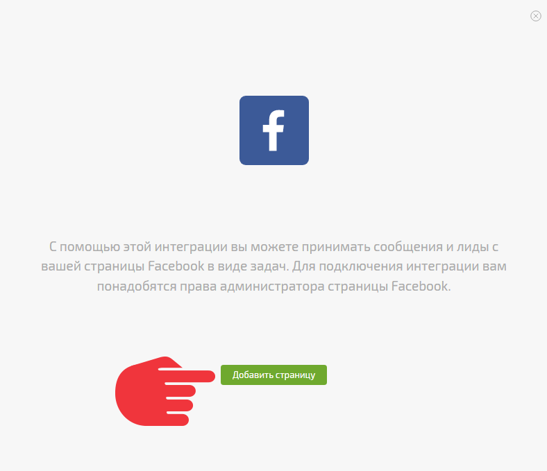

  

Страницы Facebook и Instagram подключаются в одном окне, таковы особенности интеграции у компании Мeta. Поэтому, если страницы Instagram вам подключать не надо, не выбирайте их и нажмите кнопку далее: 

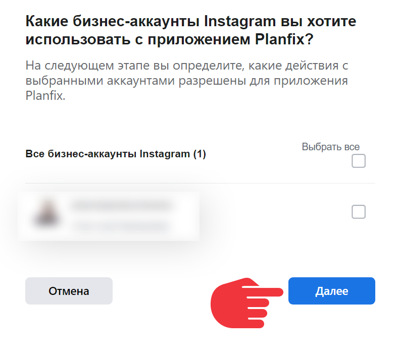

  

На следующем шаге активируйте те страницы Facebook, сообщения из которых вы хотите получать в ПланФикс: 

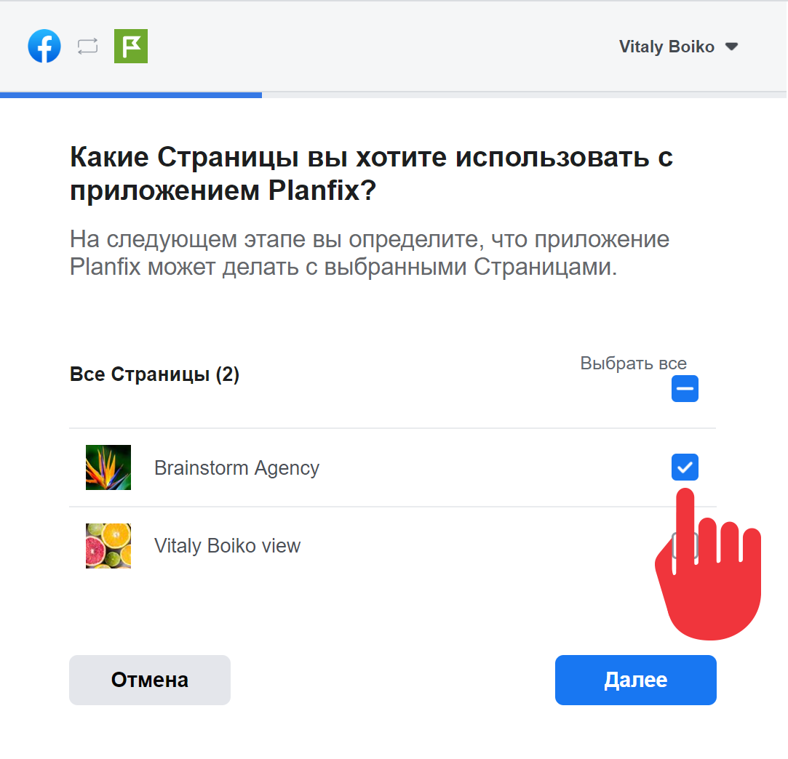

  

Обязательно разрешите ПланФиксу получать необходимую информацию из Facebook: 

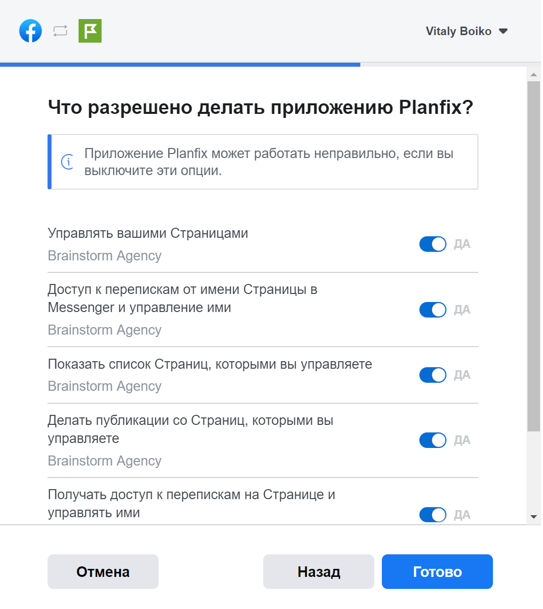

  

После подтверждения разрешений интеграция будет активирована и вы начнете получать информацию из Facebook в ПланФикс. 

Обратите внимание, если вы ранее подключали интеграцию с Facebook, при повторном подключении окно выбора страницы может не отобразиться. Для управления страницами, к которым ПланФикс будет иметь доступ, перейдите в настройки [бизнес-интеграций в Facebook](https://www.facebook.com/settings/?tab=business_tools) и добавьте нужные страницы: 

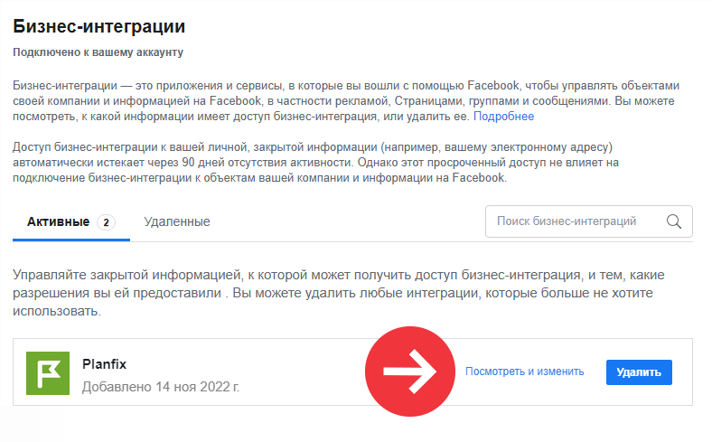

## Важно: права доступа к странице Facebook

Если при попытке подключить интеграцию вы не увидели запрос выбора страницы или список доступных страниц пуст, значит учетная запись Facebook, под которой вы авторизованы на текущий момент, не связана ни с одной корпоративной страницей. Убедитесь что вы залогинены в Facebook под нужной учетной записью и повторите процесс подключения интеграции. 

Если ваша страница управляется при помощи бизнес-менеджера Facebook и вы не видите ее в списке страниц, доступных для подключения в ПланФикс, администратор бизнес-менеджера должен добавить вам права на управления этой страницей, проведя процедуру, описанную в следующем разделе. 

  

## Подключение страниц, управляемых бизнес-менеджером

Для подключения страницы, управляемой при помощи бизнес-менеджера Facebook, администратор бизнес-менеджера должен провести следующие действия: 

  * Перейдите в [бизнес-менеджер](https://business.facebook.com/home/)

  * Зайдите в настройки компании:

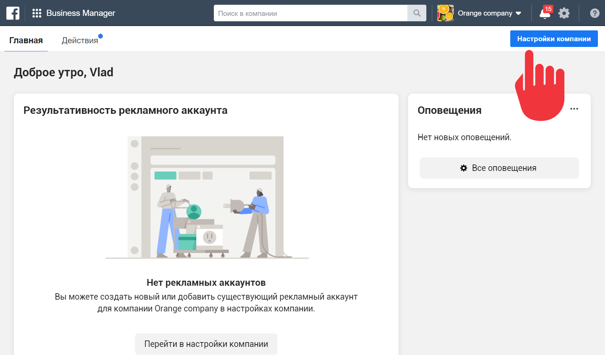

  

  * В разделе **Страницы** нажмите **Добавить людей** :

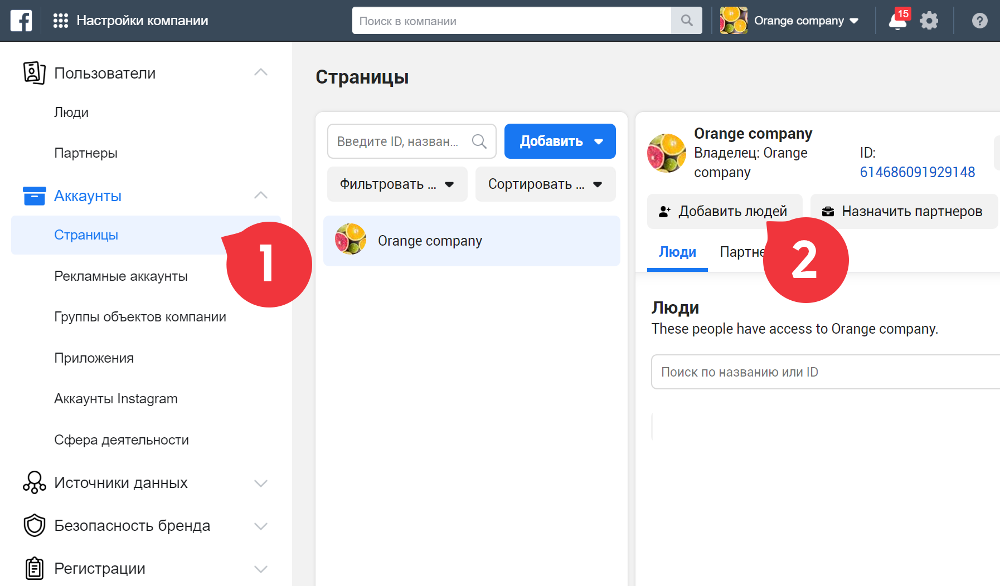

  

  * Добавьте разрешение управлять страницей нужному человеку, выбрав его в списке:

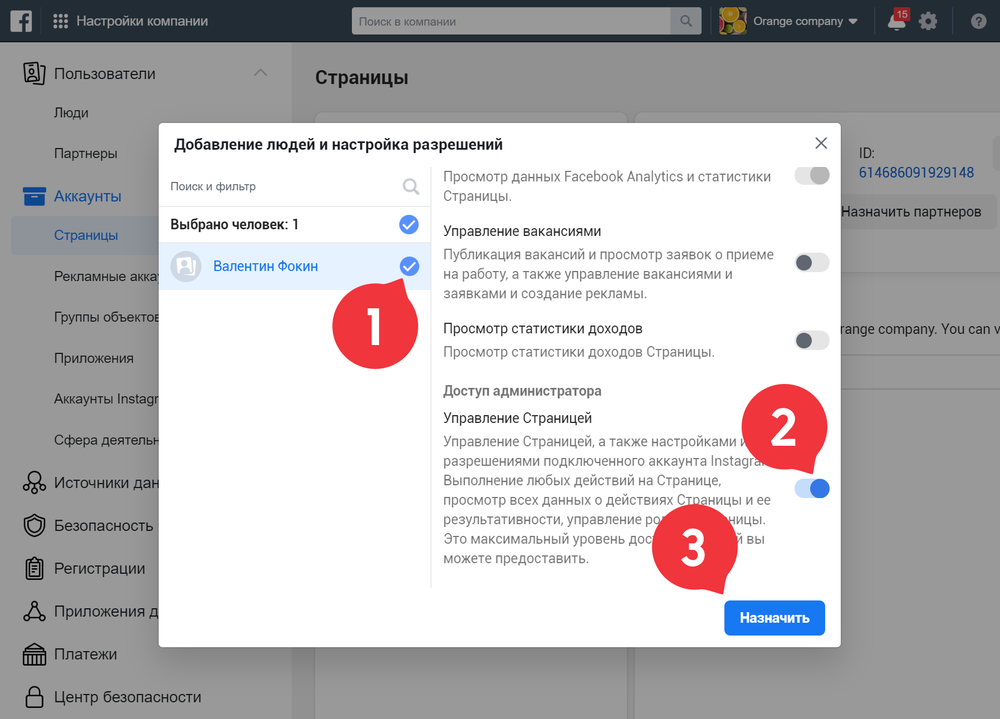

  

После этого данный человек сможет подключить интеграцию в ПланФиксе. 

  

## Использование интеграции

Пользователь Facebook пишет личное сообщение на странице, нажав эту кнопку на его странице: 

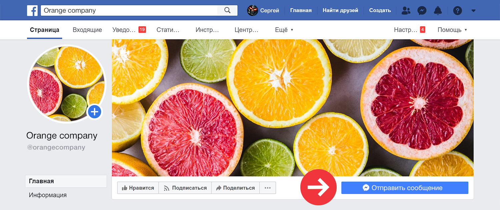

  

В ПланФиксе автоматически создается задача с текстом его сообщения. Постановщиком в этой задаче становится пользователь, написавший комментарий, а исполнителем — сотрудник, указанный в настройках интеграции или в шаблоне, по которому создаются задачи по интеграции. Если исполнителем не указан никто, система назначит им владельца аккаунта. 

Все комментарии, написанные в ПланФиксе, пользователь Facebook видит в чате, как при общении внутри соцсети: 

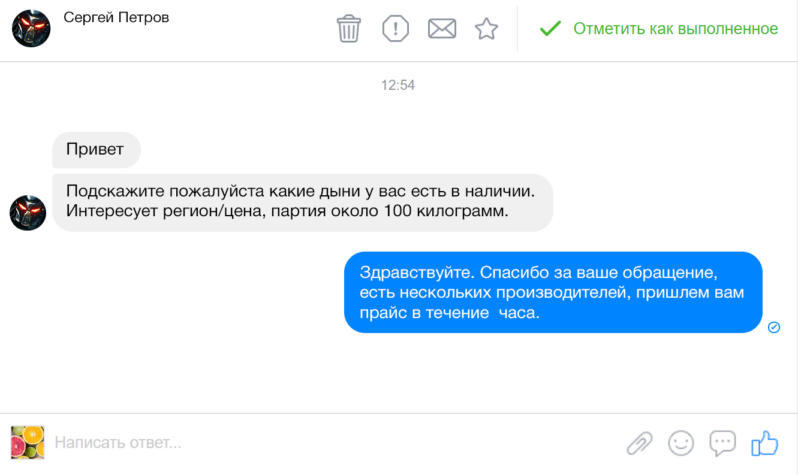

  

А вот как выглядит в ПланФиксе эта задача: 

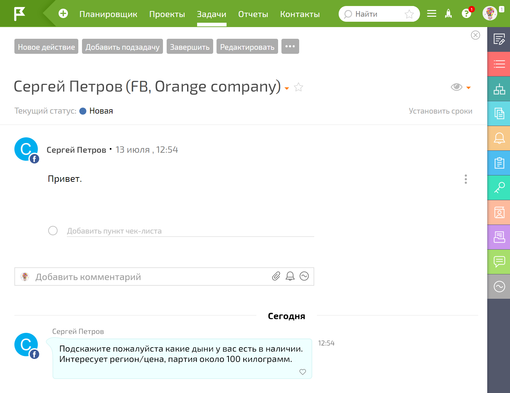

  

## Обратите внимание

  * Вы можете добавлять в свой аккаунт [несколько страниц Facebook](Подключение_нескольких_страниц_Facebook_в_разные_аккаунты_ПланФикса.md "Подключение нескольких страниц Facebook в разные аккаунты ПланФикса").

  * В ПланФикс попадают именно сообщения, отправленные пользователем на вашей странице. Новые публикации на странице (в том числе и оставленные пользователями) и другая активность в ПланФикс не попадают.

  * Вы можете выбрать [ шаблон задачи](Шаблоны_задач.md "Шаблоны задач"), по которому при поступлении новых сообщений будут создаваться задачи в ПланФиксе.

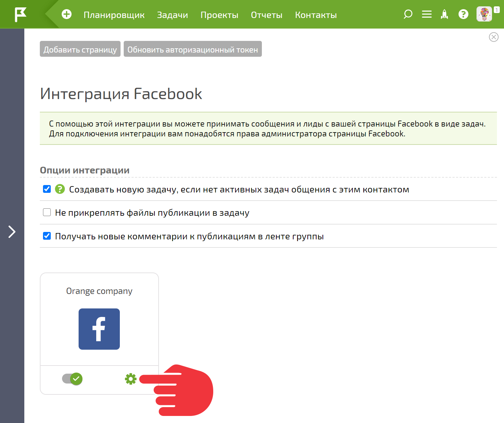

  

  

  * Убедитесь, что в используемом шаблоне указаны исполнители или добавьте их [дополнительно в настройках интеграции](Дополнительное_подключение_сотрудников.md "Дополнительное подключение сотрудников"). Если исполнители не указаны, система назначит исполнителем владельца аккаунта или сотрудника, который настраивал интеграцию.

  * Интеграция ПланФикса и Facebook доступна во всех платных и премиум-аккаунтах.

  * В настройке интеграции есть возможность активировать опцию [Создавать новую задачу, если нет активных задач общения с этим контактом](Создавать_новую_задачу_если_нет_активных_задач_общения_с_этим_контактом.md "Создавать новую задачу если нет активных задач общения с этим контактом")

  * Для получения в ПланФикс комментариев, оставленных пользователями под постами на вашей странице, [ включите соответствующую опцию](Комментарии_из_Facebook.md "Комментарии из Facebook")

  * [Не прикрепляйте файлы публикации в задачу](Опции_интеграции__не_прикреплять_файлы_публикации_в_задачу.md "Опции интеграции: не прикреплять файлы публикации в задачу"), если они не нужны.

  * Интеграция с Facebook позволяет автоматически получать в ПланФикс контакты и заявки при помощи [ Facebook Lead Ads](Интеграция_с_Facebook_Lead_Ads.md "Интеграция с Facebook Lead Ads")

  * Из истории переписки с контактом в новую задачу по умолчанию добавляется 10 последних сообщений. Это количество можно изменить: 1, 5, 10, 20, 50.

  * Начиная с 15 января 2020 года, отправлять личные сообщения пользователю Facebook можно только в течение 24 часов с момента его последнего взаимодействия со страницей. [Подробнее](https://developers.facebook.com/docs/messenger-platform/policy/policy-overview/). Но Facebook добавил несколько исключений: 

    * Если сообщения отравляются клиентам вручную, ПланФикс снабжает их тегом [«Facebook Human Agent Tag»](https://developers.facebook.com/docs/messenger-platform/send-messages/message-tags/#supported_tags). Это позволяет отправлять сообщения клиенту в течение 7 дней после последнего взаимодействия со страницей.

    * Используя автоматические сценарии ПланФикса, можно писать специальные сообщения клиентам, даже если прошло более 24 часов:

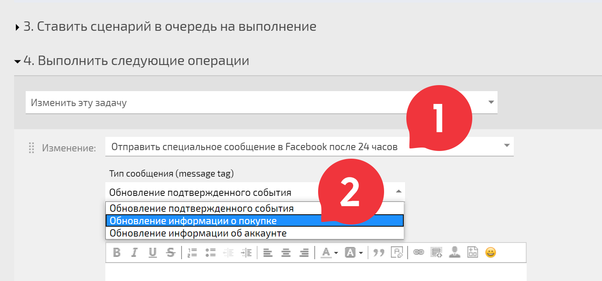

  

## Проблемы и решения

Иногда после подключения интеграции лиды не попадают в ПланФикс. 

  * Протестируйте их отправку как описано в [справке Фейсбука](https://developers.facebook.com/docs/marketing-api/guides/lead-ads/testing-troubleshooting/).

  * Если у вас такая ошибка:

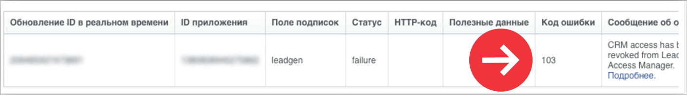

  

  * Проверьте и при необходимости дополнительно дайте права ПланФиксу к лидам, перейдя в [Business Manager](https://business.facebook.com/settings/leads-accesses):

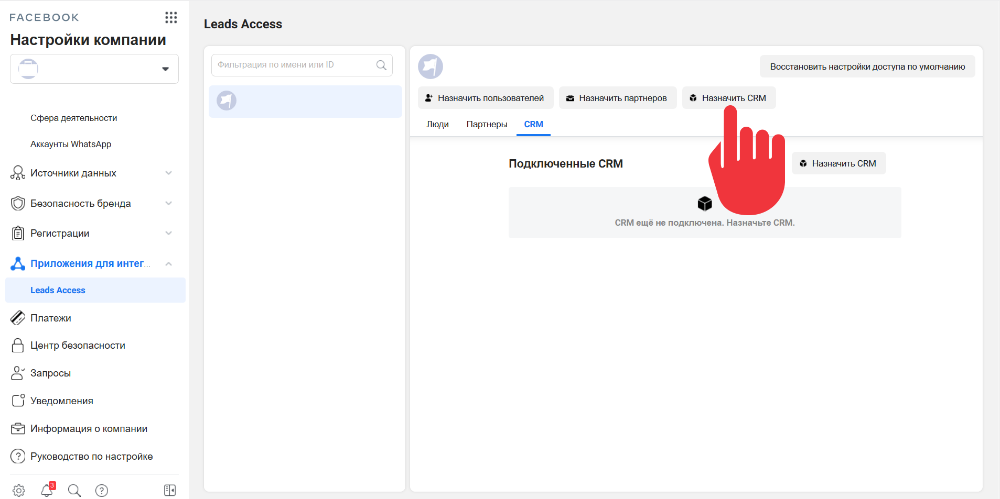

  

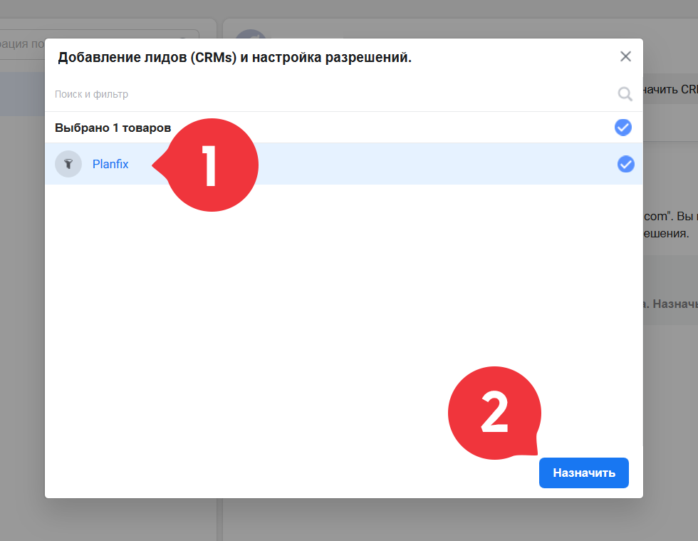

  

  * Отправляя собеседнику документы через интеграцию с Facebook, иногда в отчете об отправке уведомлений вы можете увидеть вот такую ошибку:

Ошибка отправки  

{"error":{"code":10,"error_subcode":2018336,"message":"(#10) Это действие не было отправлено в связи с новыми правилами конфиденциальности, действующими на территории Европы. Чтобы получить дополнительную информацию, ознакомьтесь с документацией для разработчиков.","type":"OAuthException","fbtrace_id": "Gfd45d7fdFgfg454g5fdFGf4545"}}

  

Она связана с тем, что отправка файлов отличных от картинок невозможна согласно [ограничениям Facebook](https://developers.facebook.com/docs/messenger-platform/europe-updates#affected) для ЕС. Ограничение касается страниц, принадлежащих компаниям, расположенным в странах ЕС или любых других страниц при взаимодействии с пользователями из стран ЕС. 

  

## Дополнительно

  * В переписке с клиентами для ответа на типовые вопросы вы можете использовать механизм [быстрых ответов](Быстрые_ответы.md "Быстрые ответы").
