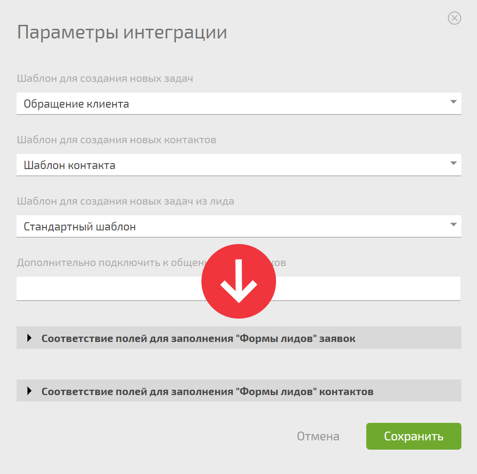

[Интеграция с Facebook](Интеграция_с_Facebook.md "Интеграция с Facebook") дает возможность автоматически получать в ПланФикс контакты и заявки при помощи [Facebook Lead Ads](https://www.facebook.com/business/ads/lead-ads). 

## Подключение интеграции

### Видеоинструкция

[Смотреть видео на YouTube](https://youtu.be/exUkHS9bQrY?si=icGZh9fO0t_SNQT3)

  

### Пошаговое руководство

  * Включите [ интеграцию с Facebook](Интеграция_с_Facebook.md "Интеграция с Facebook")

  * При необходимости, в параметрах интеграции укажите [ шаблоны задачи](Шаблоны_задач.md "Шаблоны задач") и [ контакта](Шаблоны_контактов.md "Шаблоны контактов"), по которым в ПланФиксе будут создаваться задача-лид и контакт, заполнивший лид-форму в Facebook:

  

  

  * При необходимости добавьте исполнителей, которые дополнительно будут подключаться для обработки задач-лидов

  * Укажите, если необходимо, какие поля лида в какие поля задачи или контакта добавлять:

  

## Работа интеграции

  * Клиент реагирует на вашу рекламу и заполняет лид-форму Facebook.

  * В ПланФиксе создается [ контакт](Контакты.md "Контакты") этого клиента с данными, которые он указал в форме.

  * Также создается [ задача-лид](Задачи.md "Задачи") с этим контактом в роли постановщика. В описании задачи продублированы все ответы клиента на вопросы формы, чтобы вам было удобнее их обрабатывать.

  * В качестве [ исполнителя](Исполнители_задачи.md "Исполнители задачи") к задаче подключается сотрудник (или сотрудники), который указан в настройках шаблона задачи или в [настройках интеграции](Дополнительное_подключение_сотрудников.md "Дополнительное подключение сотрудников").

  * Исполнитель видит новую задачу с данными клиента и связывается с ним.

  * В переписке с клиентами для ответа на типовые вопросы можно использовать механизм [быстрых ответов](Быстрые_ответы.md "Быстрые ответы").

  

## Полезно

  * Если добавить в [ шаблон задачи](Шаблоны_задач.md "Шаблоны задач"), по которой в ПланФиксе создается задача-лид, [ поля](Пользовательские_поля_задачи.md "Пользовательские поля задачи") с названиями, аналогичными вопросам в вашей форме в Facebook, при создании задачи эти поля будут автоматически заполнены ответами.

  * Лид попадает в ПланФикс в течение нескольких секунд с момента заполнения данных клиентом и может быть тут же обработан (получить [ звонок](Виртуальные_АТС.md "Виртуальные АТС") или электронное письмо от назначенного сотрудника).

  * Так как клиент автоматически становится постановщиком задачи-лида в ПланФиксе, вы можете [ переписываться с ним](Как_работать_с_клиентом_по_e-mail_.md "Как работать с клиентом по e-mail?") прямо в этой задаче.

  * Если вы используете конфигурацию [Управление сделками](Управление_сделками.md "Управление сделками") или другой вариант CRM в ПланФиксе, имеет смысл настроить шаблон задачи-лида таким образом, чтобы она сразу попадала на вход воронки продаж. Тогда ваши менеджеры начнут автоматически получать лиды из Фейсбук в обычном для них интерфейсе и обрабатывать в общем потоке с заявками из других источников.

  * Если клиент, заполнивший форму, уже есть в списке контактов, новый контакт для него создан не будет. Вместо этого существующий контакт будет подставлен в качестве постановщика задачи-лида и она войдет одним из пунктов в историю его работы с вами. Наличие контакта в базе проверяется по емейлу и телефону, имя не учитывается.

  * Так как задача-лид это обычная задача, то, в полном соответствии с [идеологией ПланФикса](https://planfix.ru/ideologiya/), к ней применимы все инструменты системы. Соответственно, можно и нужно использовать разнообразные [ сценарии](Автоматические_сценарии.md "Автоматические сценарии") и прочие способы автоматизации работы.

  * То же самое касается автоматизации работы с контактами. Например, вы можете автоматически помещать контакты, пришедшие из Facebook и оставившие свой емейл, в нужный [ список рассылки](Сервисы_рассылки_e-mail.md "Сервисы рассылки e-mail").
