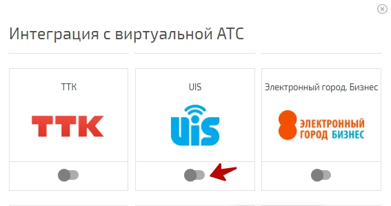
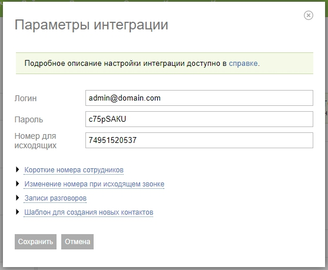
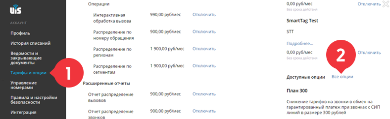
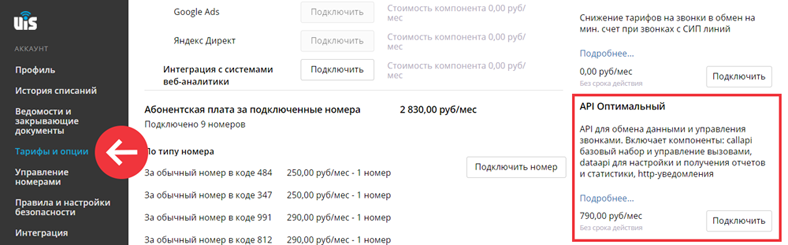
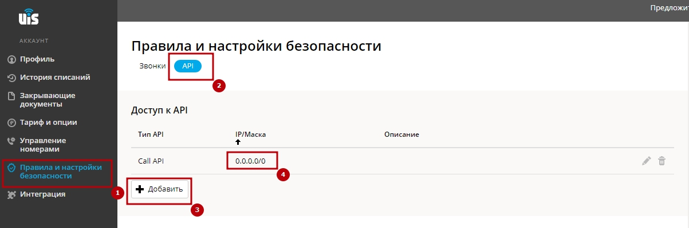
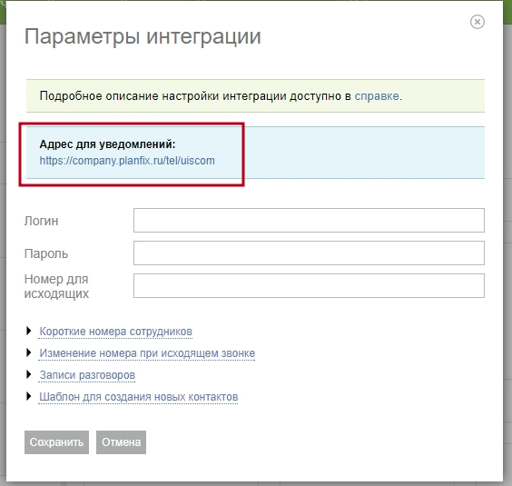
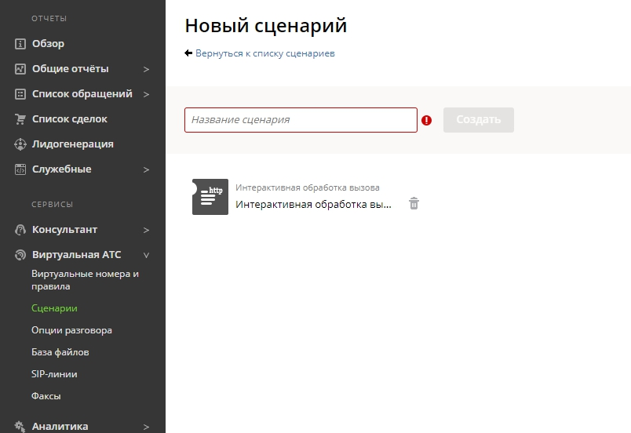
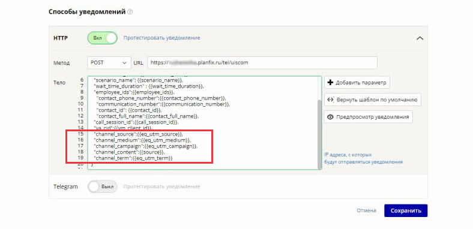

Для настройки интеграции с [виртуальной АТС UIS](http://uiscom.ru/): 

1\. Перейдите в раздел **Управление аккаунтом / Интеграции** (доступен владельцу или администратору аккаунта). Нажмите на **Виртуальные АТС** : 

  

и в появившемся списке нажмите **Активировать** напротив UIS. 

  

2\. В открывшемся окне введите логин, пароль от личного кабинета UIS, а также принадлежащий вам виртуальный номер, который будет использоваться при исходящих вызовах: 

  

3\. Укажите короткие номера сотрудников 

  

4\. В Личном кабинете UIS для работы интеграции должен быть активирован тариф «API Оптимальный». Для этого перейдите в раздел «Тарифы и опции» и разверните «Все опции»: 

  

5\. В личном кабинете UIS разрешите доступ к Call API и к Data API с любых IP-адресов: 

  

6\. Обратитесь в поддержку UIS, чтобы вам прописали необходимые для интеграции с ПланФиксом уведомления, указав им адрес для уведомлений из параметров интеграции в ПланФиксе: 

  

При необходимости можно прописать их самостоятельно в Личном кабинете UIS в разделе "Сервисы и статистика - Уведомления" 

## Уведомления

Все уведомления отправляются методом POST на адрес для уведомлений из параметров интеграции. 

1\. Входящий звонок на виртуальный номер 

    

    

    {  

      "notification_mnemonic":{{notification_mnemonic}},

      "notification_name":{{notification_name}},

      "virtual_phone_number":{{virtual_phone_number}},

      "notification_time":{{notification_time}},

      "scenario_name": {{scenario_name}},

        "contact_phone_number":{{contact_phone_number}},

        "communication_number":{{communication_number}},

        "contact_id": {{contact_id}},

        "contact_full_name": {{contact_full_name}},

      "call_session_id":{{call_session_id}}

    }

2\. Завершение звонка 

    

    

    {  

      "notification_name":{{notification_name}},

      "notification_mnemonic":{{notification_mnemonic}},

      "virtual_phone_number":{{virtual_phone_number}},

      "notification_time":{{notification_time}},

      "external_id": {{external_id}},

        "contact_phone_number":{{contact_phone_number}},

        "communication_number":{{communication_number}},

        "employee_full_name": {{employee_full_name}},

        "employee_id": {{employee_id}},

        "call_source": {{call_source}},

        "direction": {{direction}},

        "call_session_id":{{call_session_id}},

        "scenario_name": {{scenario_name}},

        "talk_time_duration": {{talk_time_duration}},

        "total_time_duration": {{total_time_duration}},

        "wait_time_duration": {{wait_time_duration}},

        "tag_names": {{tag_names}}

    }

3\. Записанный разговор 

    

    

    {

      "notification_name": {{notification_name}},

      "notification_mnemonic":{{notification_mnemonic}},

      "virtual_phone_number": {{virtual_phone_number}},

      "notification_time": {{notification_time}},

      "scenario_name": {{scenario_name}},

        "contact_phone_number": {{contact_phone_number}},

        "communication_number": {{communication_number}},

        "contact_id": {{contact_id}},

        "contact_full_name": {{contact_full_name}},

      "call_session_id": {{call_session_id}},

        "employee_full_name": {{employee_full_name}},

        "employee_id": {{employee_id}},

        "file_link": {{file_link}},

        "file_duration": {{file_duration}},

      "tag_ids": {{tag_ids}},

      "tag_names": {{tag_names}}

    }

4\. Ожидание ответа 

    

    

    {  

      "notification_name":{{notification_name}},

      "notification_mnemonic":{{notification_mnemonic}},

      "virtual_phone_number": {{virtual_phone_number}},

      "notification_time":{{notification_time}},

      "external_id": {{external_id}},

        "contact_phone_number":{{contact_phone_number}},

        "contact_id": {{contact_id}},

        "employee_full_name": {{employee_full_name}},

        "employee_id": {{employee_id}},

      "call_source": {{call_source}},

      "call_session_id":{{call_session_id}},

      "direction": {{direction}},

      "leg_id": {{leg_id}}

    }

5\. Исходящий звонок 

    

    

    {

      "notification_name": {{notification_name}},

      "notification_mnemonic":{{notification_mnemonic}},

      "virtual_phone_number": {{virtual_phone_number}},

      "notification_time": {{notification_time}},

        "contact_phone_number":{{contact_phone_number}},

        "contact_id":{{contact_id}},

        "contact_full_name":{{contact_full_name}},

      "call_session_id":{{call_session_id}},

        "employee_full_name":{{employee_full_name}},

        "employee_id":{{employee_id}},

        "employee_phone_number":{{employee_phone_number}}

    }

6\. Начало разговора 

    

    

    {  

      "notification_name":{{notification_name}},

      "notification_mnemonic":{{notification_mnemonic}},

      "virtual_phone_number": {{virtual_phone_number}},

      "notification_time":{{notification_time}},

      "external_id": {{external_id}},

        "contact_phone_number":{{contact_phone_number}},

        "contact_id": {{contact_id}},

        "employee_full_name": {{employee_full_name}},

        "employee_id": {{employee_id}},

      "call_source": {{call_source}},

      "call_session_id":{{call_session_id}},

      "direction": {{direction}},

      "leg_ids": {{leg_ids}}

    }

7\. Окончание разговора 

    

    

    {  

      "notification_name":{{notification_name}},

      "notification_mnemonic":{{notification_mnemonic}},

      "virtual_phone_number":{{virtual_phone_number}},

      "notification_time":{{notification_time}},

      "external_id": {{external_id}},

        "contact_phone_number":{{contact_phone_number}},

        "communication_number":{{communication_number}},

        "employee_full_name": {{employee_full_name}},

        "employee_id": {{employee_id}},

        "call_source": {{call_source}},

        "call_session_id":{{call_session_id}},

        "direction": {{direction}},

        "scenario_name": {{scenario_name}},

        "talk_time_duration": {{talk_time_duration}},

      "leg_ids": {{leg_ids}}

    }

8\. Потерянный звонок 

    

    

    {  

      "notification_name":{{notification_name}},

      "notification_mnemonic":{{notification_mnemonic}},

      "virtual_phone_number":{{virtual_phone_number}},

      "notification_time":{{notification_time}},

      "scenario_name": {{scenario_name}},

      "wait_time_duration" : {{wait_time_duration}},

      "employee_ids":{{employee_ids}},

        "contact_phone_number":{{contact_phone_number}},

        "communication_number":{{communication_number}},

        "contact_id": {{contact_id}},

        "contact_full_name":{{contact_full_name}},

      "call_session_id":{{call_session_id}}

    }

  

## Настройка перенаправления звонка на ответственного

В личном кабинете UIS в сценарии Виртуальной АТС создайте операцию интерактивной обработки вызова. 

  

В этом сценарии необходимо задать: 

**URI, по которому связываться с обработчиком запросов:** Адрес для уведомлений из параметров интеграции в ПланФиксе + /interactive - например для аккаунта test: <https://test.planfix.ru/tel/uiscom/interactive>

**метод отправки запроса:** POST **параметры, которые необходимо включать в запрос:** call_session_id, numa, numb 

Мы настоятельно рекомендуем настраивать действия Виртуальной АТС на случай, если ПланФикс не даст ответа. 

## Добавление параметров в аналитику «Звонок»

Вы можете сохранять в ПланФиксе дополнительные данные: 

  * Добавьте нужные параметры в уведомления на стороне UIS:

  

  * Затем добавьте в аналитику поля типа «Строка» с именами равными именам необходимых параметров.
