ПланФикс позволяет вести переписку с клиентами, которые пишут сообщения в ваше сообщество ВКонтакте прямо из ПланФикса. 

Интеграция использует официальные API ВКонтакте. 

  

## Навигация

  * Настройка интеграции в ПланФиксе

  * Настройка интеграции в ВКонтакте

  * Работа с личными сообщениями

  * Получение в ПланФикс комментариев из ВКонтакте

  * Получение заявок с лид-форм ВКонтакте

  

## Настройка интеграции в ПланФиксе

Настроить интеграцию может администратор аккаунта ПланФикса в разделе **Управление аккаунтом** , вкладка **Интеграции - Социальные сети** : 

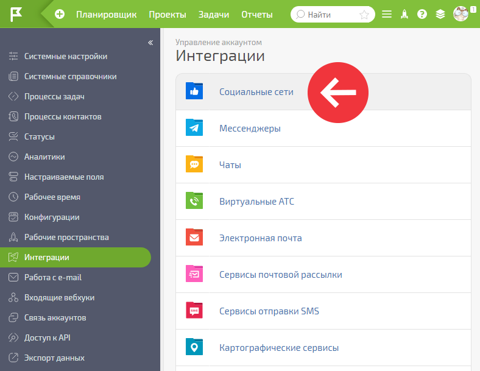

  

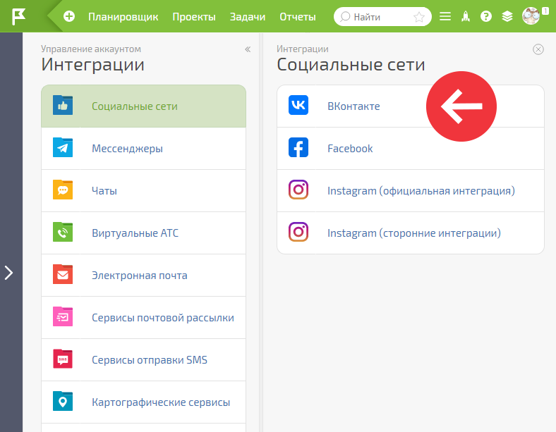

  

После этого нужно нажать на **ВКонтакте** , а затем на **Добавить группу** : 

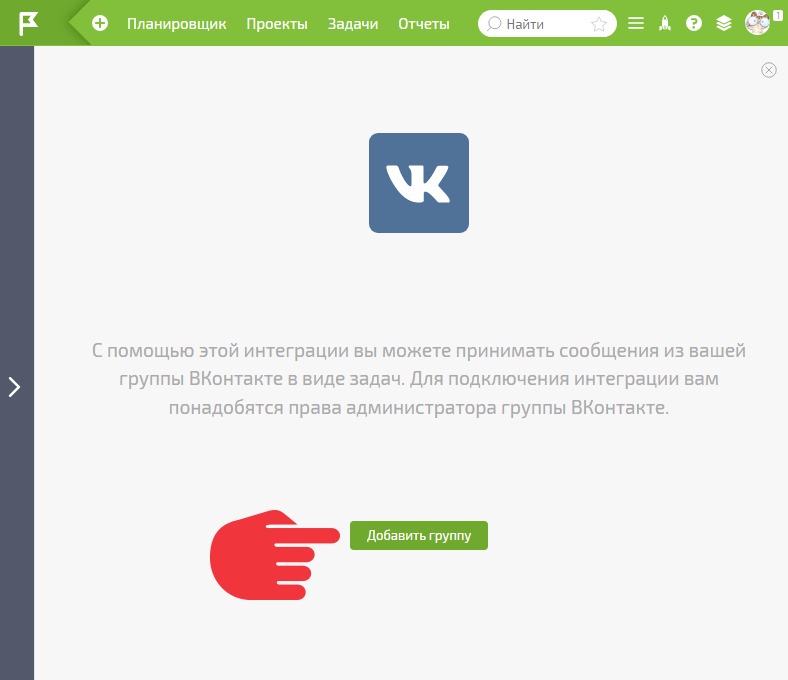

  

В появившемся окошке подтвердить согласие: 

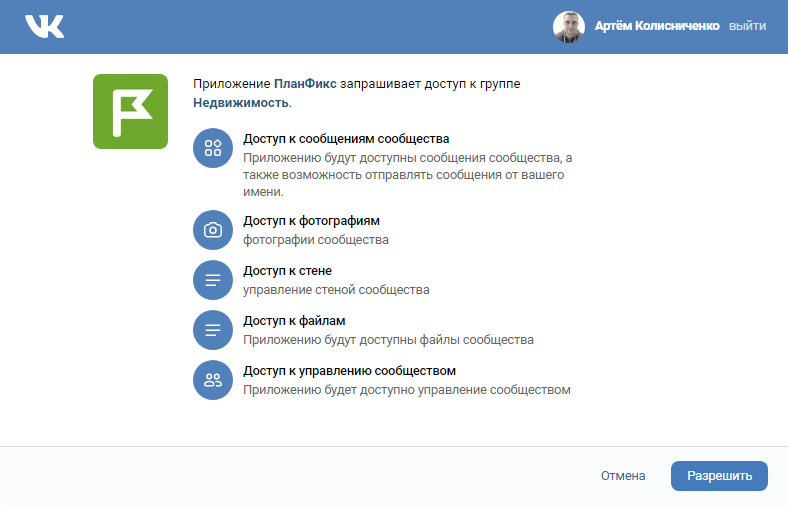

  

После этого на странице интеграции в ПланФиксе появится название и логотип вашей группы. Для начала получения сообщения из нее нужно: 

  * Кликнуть на **Активировать** :

  

  * И настроить параметры интеграции:

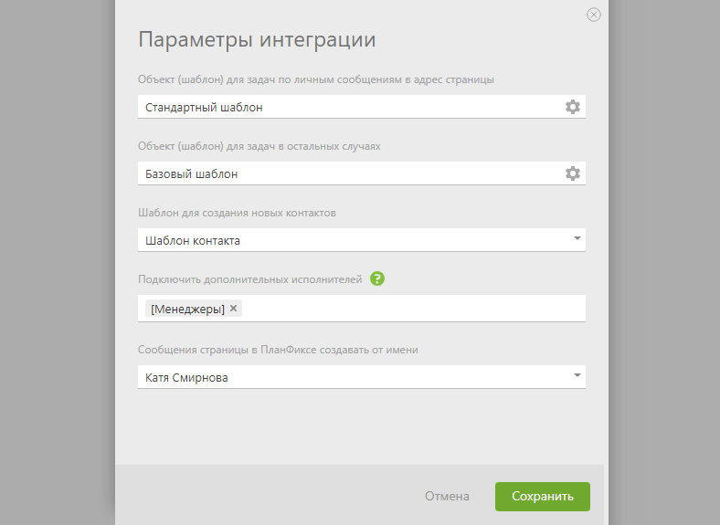

  

и подтвердить разрешение на получение информации из группы: 

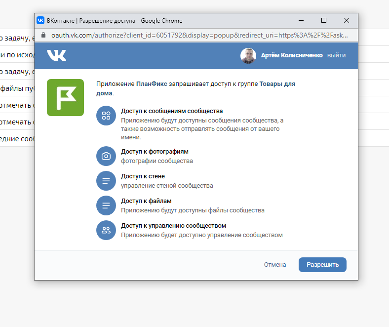

  

Если все сделано верно, кнопка **Активировать** станет зеленой: 

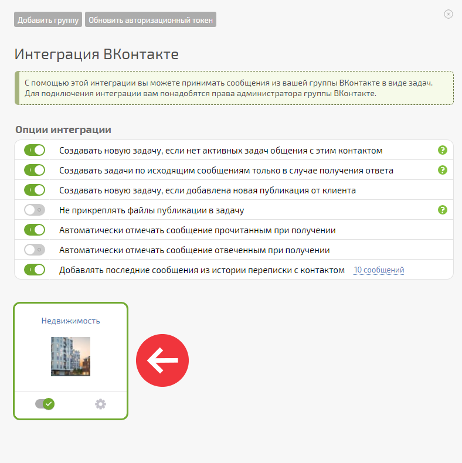

## Настройка интеграции в ВКонтакте

После окончания настройки интеграции в ПланФиксе вы увидите информационное окно: 

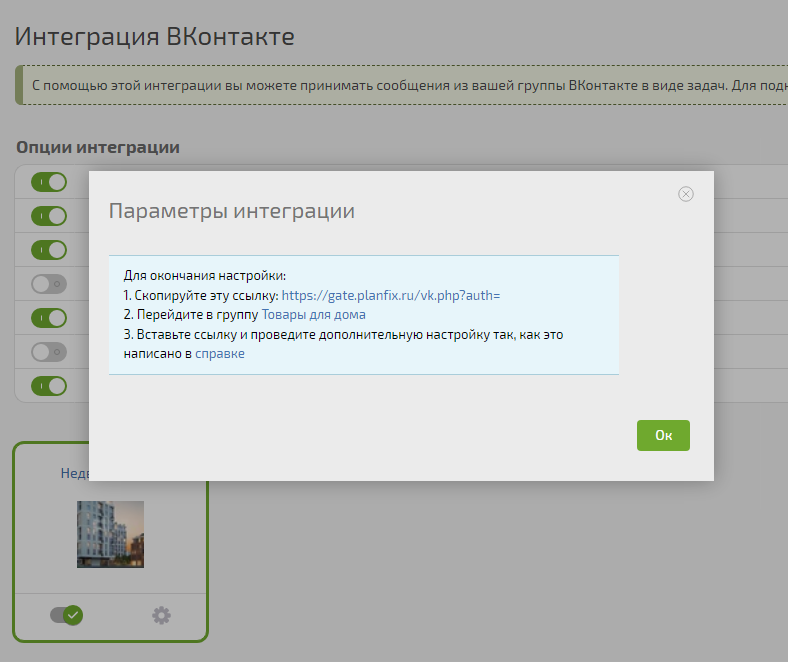

  

Для окончания настройки вам необходимо сделать следующее: 1\. **Скопируйте** из него указанную ссылку. 2\. **Перейдите** в управление группой ВКонтакте и **вставьте** в соответствующее поле эту ссылку и ключ, а также отметьте нужные типы контента, который будет попадать в ПланФикс, как это показано ниже. 

**Важно:**

  * Указывайте последнюю версию API ВКонтакте. Обычно она первая в списке.

  * Без настроек во ВКонтакте интеграция работать не будет.

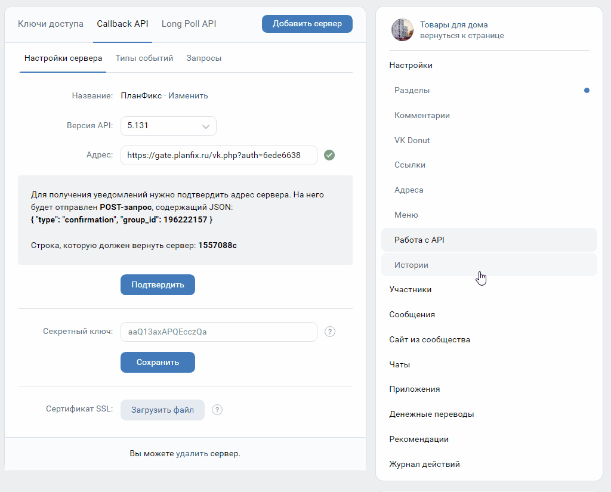

    Посмотреть [в новом окне](https://p.pfx.so/pf/mq/bWhxn1.gif) и большем размере.

  

## Работа с личными сообщениями

Пользователь ВКонтакте пишет личное сообщение в сообщество, нажав эту кнопку на его странице: 

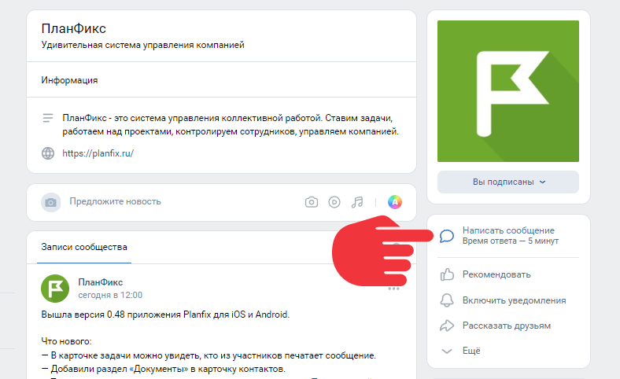

  

В ПланФиксе автоматически создается задача с текстом его сообщения. Все комментарии, написанные в ПланФиксе, пользователь ВКонтакте видит в чате, как при общении внутри соцсети: 

  

В то же время в ПланФиксе это выглядит как обычная задача: 

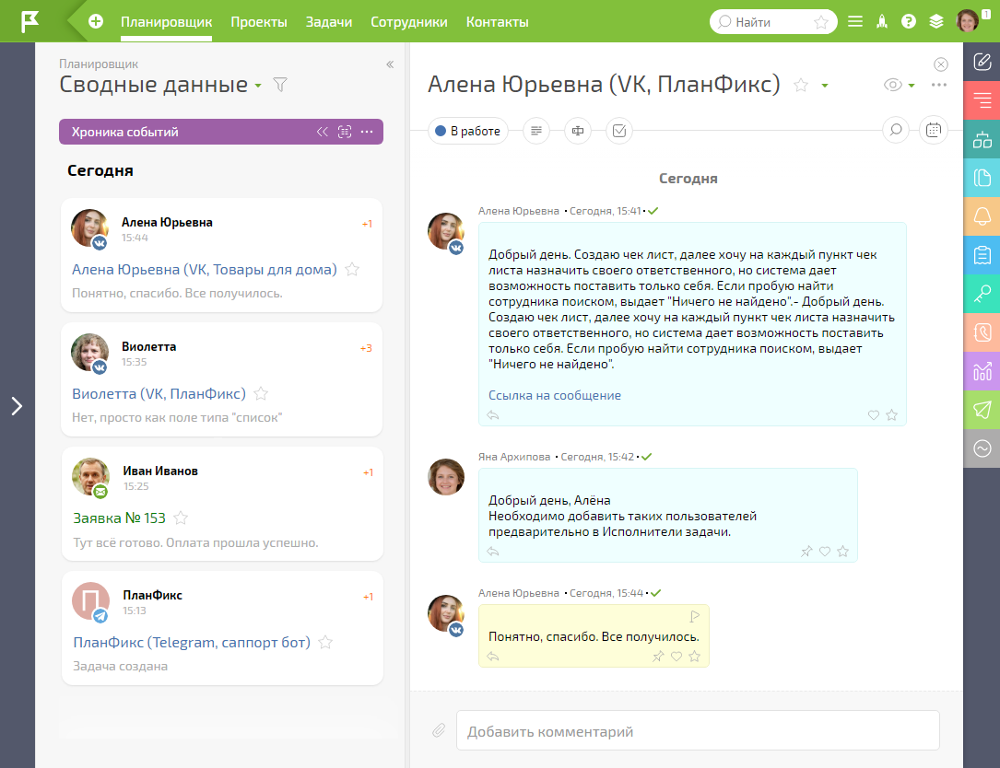

  

**Полезно:** Если вы отредактируете комментарий в ПланФиксе, его текст в ВК тоже изменится. Это позволяет исправлять ошибки и опечатки в отправленных клиенту сообщениях. 

  

## Получение в ПланФикс комментариев из ВКонтакте

Вы можете включить получение в ПланФикс комментариев, оставляемых пользователями ВК к публикациям, обсуждениям или фотографиям в группе 

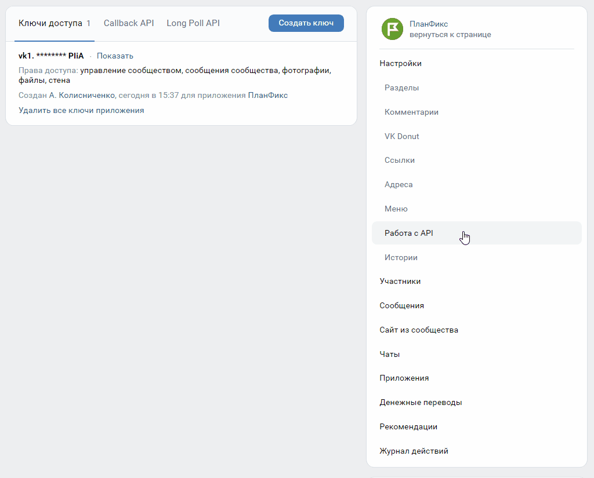

    Посмотреть [в новом окне](https://p.pfx.so/pf/Yn/EtPBqf.gif) и большем размере.

  

В работе с комментариями из ВК в ПланФиксе используется следующая логика: 

  * Для каждого поста / фотографии / видео / обсуждения создается отдельная задача в ПланФиксе. Это происходит автоматически, в момент появления нового комментария к этой публикации.

  * Постановщиком этой задачи становится сотрудник, указанный в шаблоне в настройках интеграции. Если в шаблоне выбрана опция **Создатель задачи** , постановщиком становится сотрудник, который настраивал интеграцию.

  * Исполнителями задачи становятся исполнители, указанные в шаблоне, по которому создаются задачи. В настройках интеграции можно указать сотрудников, которые [дополнительно подключаются](Дополнительное_подключение_сотрудников.md "Дополнительное подключение сотрудников") к задаче в качестве исполнителей.

  * Если появляется новый комментарий к публикации, которая уже присутствует в ПланФиксе в виде задачи, то он добавляется в эту задачу новым действием.

  * Если задача по данной публикации завершена и в настройках интеграции активирована опция **Создавать новую задачу, если нет активных задач общения с этим контактом** , будет создана новая задача по этой публикации и в нее добавлен этот комментарий

  * Возможность отвечать на комментарий пользователя прямо из ПланФикса есть только для комментариев, оставленных к постам на стене группы. Для ответа достаточно выделить получателя в блоке **Уведомить об этом** при создании нового действия.

  * Для ответа на комментарии, оставленные к другим типам публикаций в группе ВК, необходимо перейти в ВК и ответить там. Для удобства под каждым комментарием в ПланФиксе отображается прямая ссылка на него в ВК.

  * Если в ваш ответ на комментарий под публикацией на странице сообщества вкралась ошибка, исправить ее можно только в самом ВК.

  

## Получение заявок с лид-форм ВКонтакте

Вы можете включить получение в ПланФикс данных, оставленных пользователями ВК в ваших формах сбора заявок. Для этого активируйте чекбокс в настройках API (**ВКонтакте / Управление страницей / Работа с API / Callback API / Типы событий**): 

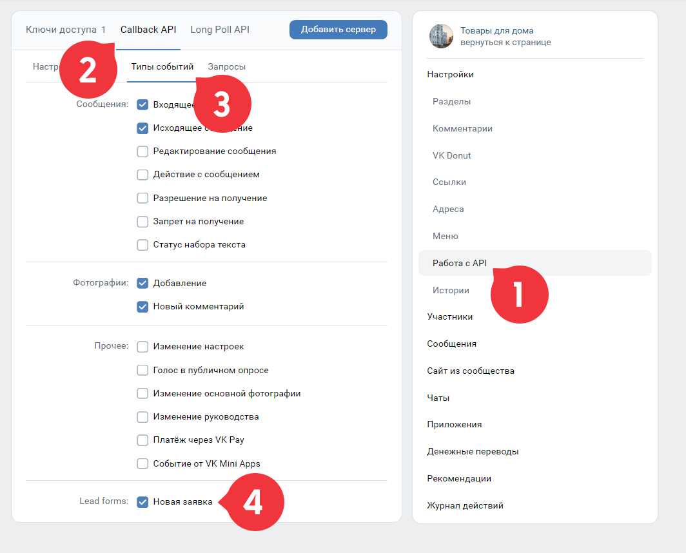

  

Особенностью этого типа интеграции является то, что если вы добавите в шаблон задачи, по которой создается лид в ПланФиксе, пользовательские поля с названиями, аналогичными названиям полей лид-формы ВК, эти поля будут автоматически заполнены данными из формы. Подробнее: [Сбор заявок: лид-форма ВКонтакте](https://planfix.com/ru/blog/sbor-zayavok-lid-forma-vkontakte/)

  

## Обратите внимание

  * Вы можете добавлять в свой аккаунт несколько групп ВКонтакте.

  * Интеграция работает только с открытыми группами.

  * Вы можете выбрать [ шаблон задачи](Шаблоны_задач.md "Шаблоны задач"), по которому при поступлении новых сообщений будут создаваться задачи в ПланФиксе.

  * Убедитесь, что в используемом шаблоне указаны исполнители.

  * По правилам сети ВКонтакте, вы можете написать пользователю только в течение 10 дней с момента его последнего комментария.

  * Интеграция ПланФикса и ВКонтакте доступна во всех платных и премиум-аккаунтах.

  * В настройке интеграции есть возможность активировать опцию [Создавать новую задачу, если нет активных задач общения с этим контактом](Создавать_новую_задачу_если_нет_активных_задач_общения_с_этим_контактом.md "Создавать новую задачу если нет активных задач общения с этим контактом")

  * При работе с автоматическими рассылками в ВКонтакте удобно активировать опцию [Создавать задачи по исходящим сообщениям только в случае получения ответа](Создавать_задачи_по_исходящим_сообщениям_только_в_случае_получения_ответа.md "Создавать задачи по исходящим сообщениям только в случае получения ответа")

  * [ Не прикрепляйте файлы публикации в задачу](Опции_интеграции__не_прикреплять_файлы_публикации_в_задачу.md "Опции интеграции: не прикреплять файлы публикации в задачу"), если они вам не нужны в ней.

  * Из истории переписки с контактом в новую задачу по умолчанию добавляется 10 последних сообщений. Это количество можно изменить: 1, 5, 10, 20, 50.

  

## Важно

Для работы с массовыми рассылками из ВКонтакте, Instagram и WhatsApp в ПланФиксе действует специальный механизм. Пока он работает следующим образом: если в течение 5 минут система обнаруживает больше 3 однотипных исходящих сообщений — они считаются массовой рассылкой. 

Такие сообщения сохраняются в базу ПланФикса, но в задачи не добавляются, пока на такое сообщение не будет получен ответ клиента. Когда ответ поступит, ПланФикс проверит наличие сообщения в базе и, если оно найдено, добавит сообщение в задачу вместе с ответом клиента. 

Обратите внимание, в базе ПланФикса сообщения с признаком массовой рассылки хранятся один месяц. 

Такой механизм реализован, чтобы хроника уведомлений участников задачи меньше захламлялась ненужными сообщениями и не создавала лишнюю нагрузку на сервера ПланФикса. Такая нагрузка может сильно задерживать обработку других сообщений. 

  

## Дополнительно

  * В переписке с клиентами для ответа на типовые вопросы вы можете использовать механизм [быстрых ответов](Быстрые_ответы.md "Быстрые ответы").
