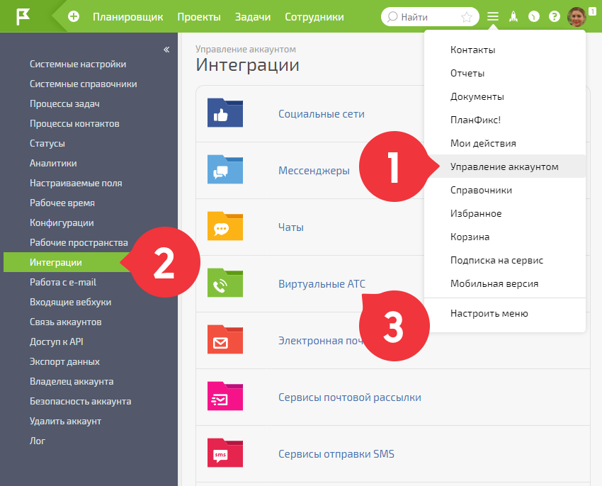
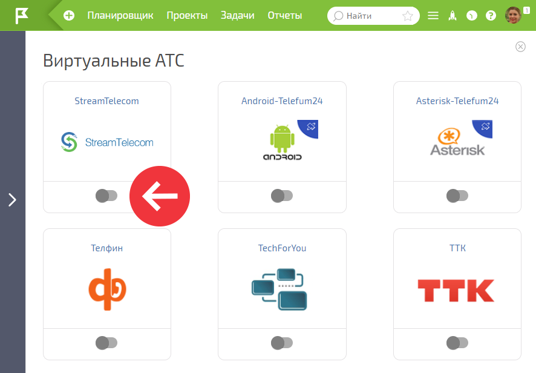
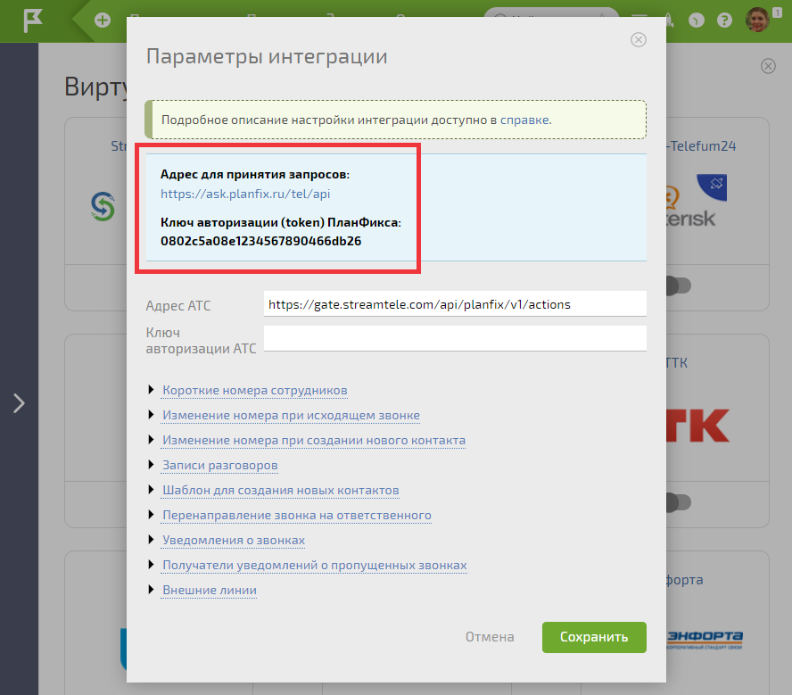
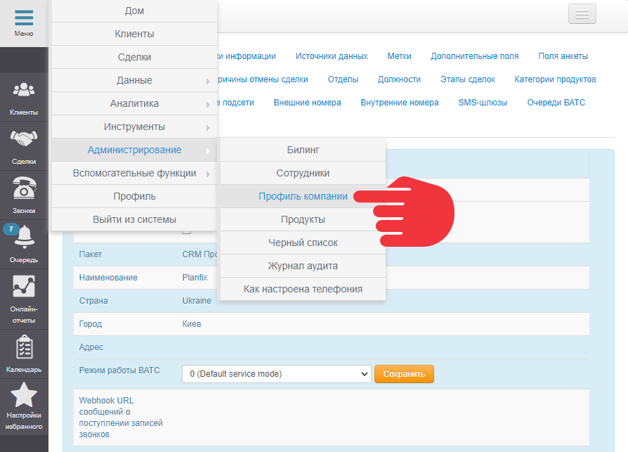
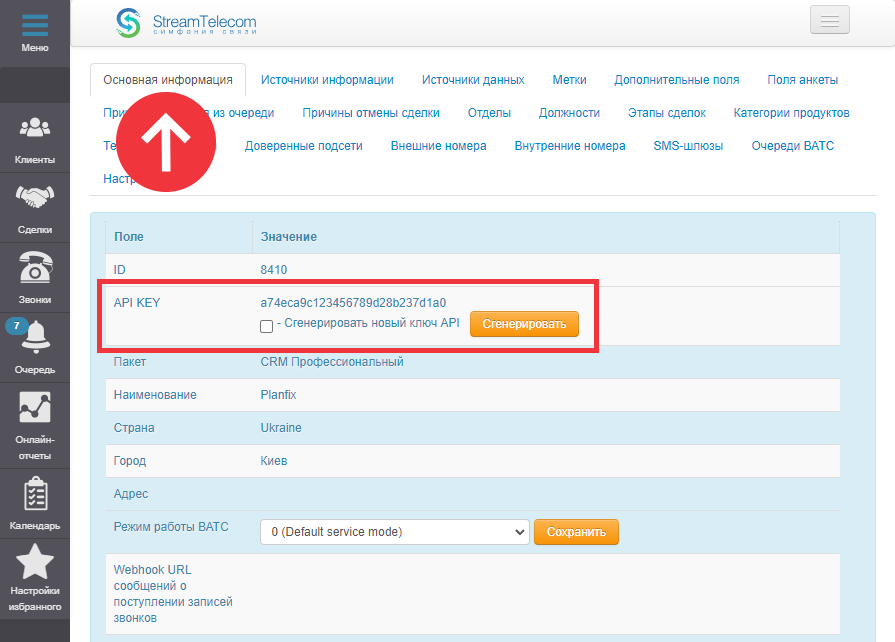
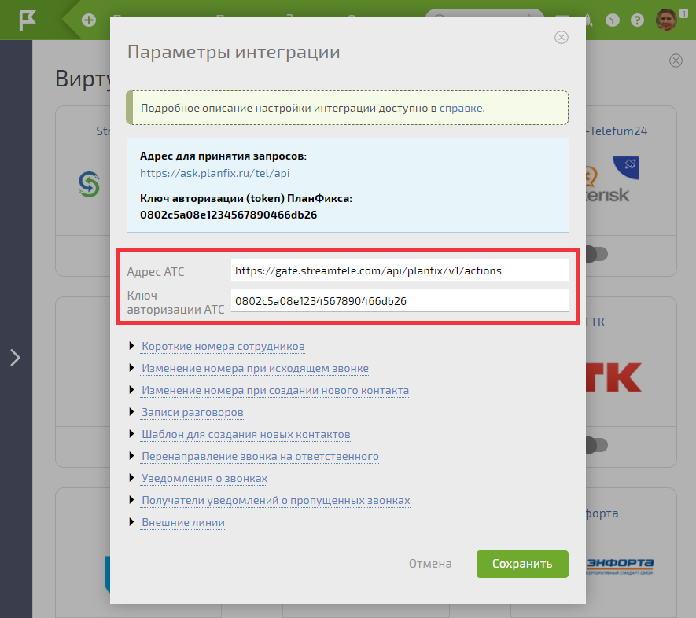
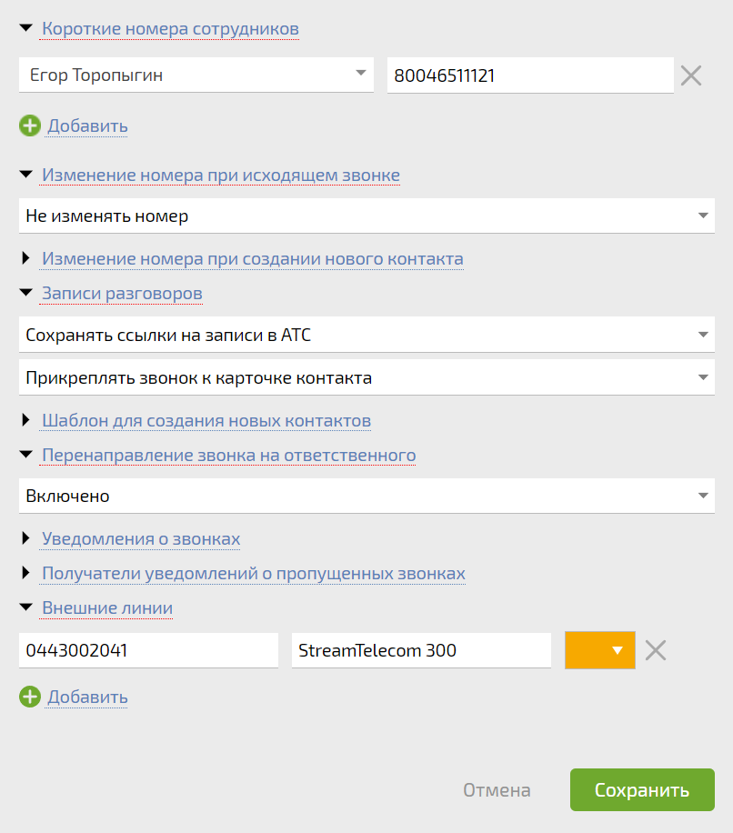

Для настройки интеграции с виртуальной АТС [StreamTelecom](https://streamtele.com/ru/): 

  * Перейдите в раздел **Управление аккаунтом** — **Интеграции** — **Виртуальные АТС** :

  

  * В списке АТС найдите **StreamTelecom** и активируйте интеграцию:

  

  * В открывшемся окне скопируйте **Адрес для принятия запросов** и **Ключ авторизации (token) ПланФикса** —передайте эти данные в StreamTelecom вашему менеджеру для активации интеграции:

  

  * В личном кабинете StreamTelecom перейдите в раздел **Меню** — **Администрирование** — **Профиль компании** :

  

  * На вкладке **Основная информация** скопируйте API ключ:

  

  * Вернитесь в окно настроек интеграции в ПланФиксе и вставьте его в поле **Ключ авторизации АТС**. В поле **Адрес АТС** укажите следующий URL: **https://gate.streamtele.com/api/planfix/v1/actions** :

  

  * Так же в настройках интеграции вы можете: 

    * Закреплять внутренние линии за сотрудниками. Они указываются в полном формате, но звонить можно по коротким номерам, например, 201.

    * Управлять перенаправлением вызова на ответственного. Можно выключить, включить только в рабочее время, включить постоянно.

    * Выбрать вариант хранения аудиозаписей в ПланФиксе. Можно выбрать, куда будет крепиться звонок (в карточке контакта, в карточке контакта скрытым комментарием, к последней активной задаче контакта, к последней активной задаче контакта скрытым комментарием) и нужно ли сохранить саму запись, сохранить ссылку на запись в StreamTelecom PBX или не сохранять вовсе.

    * Записать внешние номера компании как **Внешние линии** и дать линиям названия, которые будут отображаться в карточке звонка.

