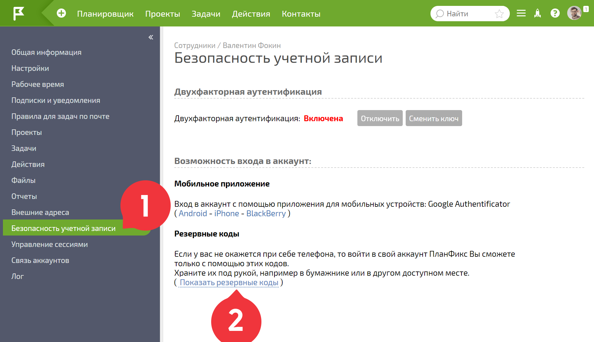

При включенной опции [Двухфакторная аутентификация](Двухфакторная_аутентификация.md "Двухфакторная аутентификация") для входа в аккаунт Вам необходимо ввести одноразовый пароль, генерируемый мобильным приложением. 

Если у Вас нет под рукой мобильного телефона, в свой аккаунт можно войти используя ранее сохраненные **резервные пароли**. 

Для получения резервных кодов нужно зайти в свою [ карточку](Страница_пользователя.md "Страница пользователя"), на вкладку **Безопасность аккаунта** : 

  

Резервные коды можно сохранить в файл или распечатать. Если Вы сомневаетесь в надежности кодов или они заканчиваются — можно сгенерировать новые. 

## История из жизни о пользе резервных паролей

Все случилось совершенно неожиданно. 

Мой четырехлетний сын взял поиграть смартфон, на котором было установлено приложение Google Authenticator. Обычно он только устанавливает приложения на телефон, а тут оказалось, что он что-то удалил. И это “что-то” был как раз Google Authenticator. 

То, что случилось, я понял немного позже, когда попытался зайти в ПланФикс. Одноразового пароля, сгенерированного мобильным приложением, естественно, у меня не было, а простая переустановка Google Authenticator не решала проблему. 

Если бы в тот момент у меня были сохранены резервные коды, я бы без проблем зашел в ПланФикс и зарегистрировал новую копию Google Authenticator. Но увы, коды не были предварительно сохранены. Хорошо, что я разработчик ПланФикса и решил свою проблему. 

А что в такой ситуации будете делать вы? 

**Резюме** : если Вы планируете использовать двухфакторную аутентификацию - обязательно сохраните в надежное место резервные пароли. 

## Важно

  * Если по какой-то причине Вам недоступен телефон с мобильным приложением **Google Authenticator** и  резервные пароли, Вам необходимо обратиться к администратору своего аккаунта. Он может [ отключить двухфакторную аутентификацию](Выключение_двухфакторной_аутентификации.md "Выключение двухфакторной аутентификации") для вашей учетной записи и вы сможете войти в нее, используя только логин и пароль.
