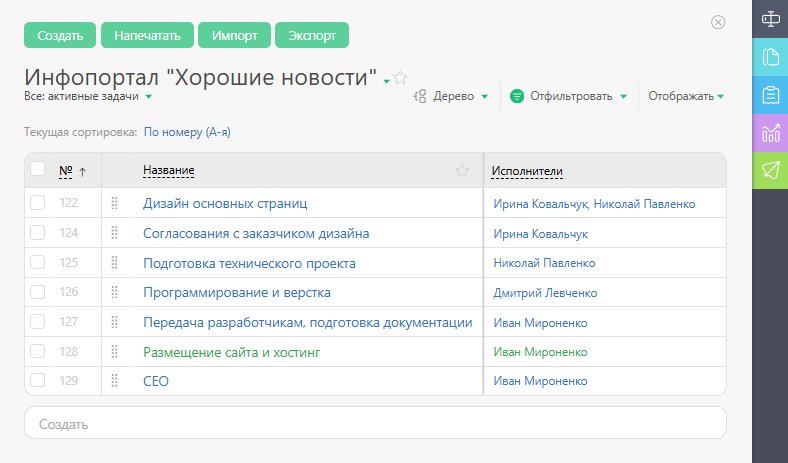
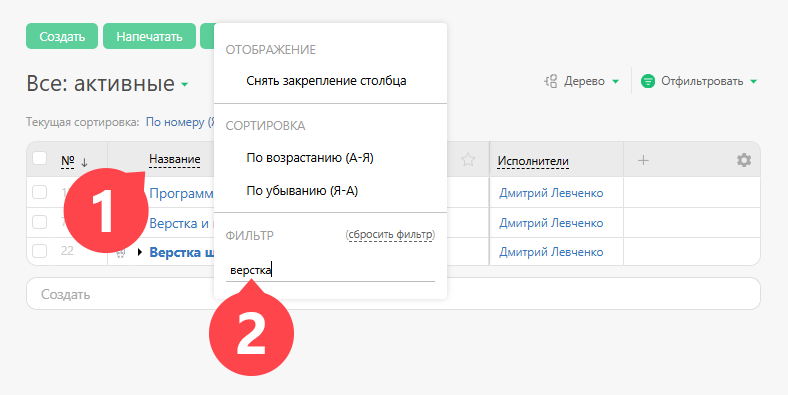
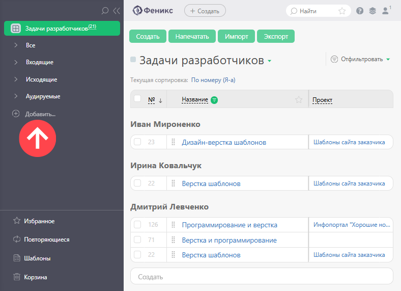
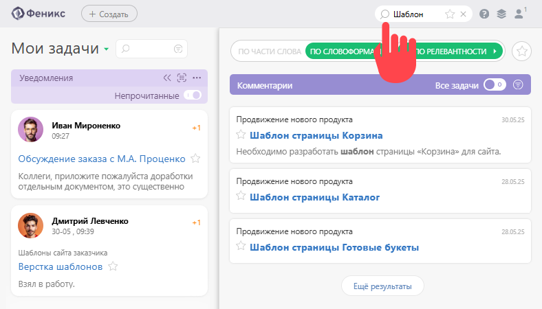
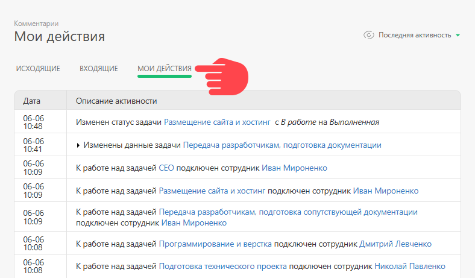

Вы можете использовать разные способы, в зависимости от ситуации. 

Например: 

  * **Классический** — в разделе "Проекты" найдите проект, к которому принадлежит задача, и войдите в него. Вы увидите полный список задач этого проекта, в котором найти нужную задачу будет гораздо легче:

  

  * **С помощью быстрого поиска** :

  

  * **С помощью фильтра** — зайдите в раздел "Задачи", найдите нужную задачу во Входящих или Исходящих задачах или [ задайте собственные критерии отбора](Фильтры_задач.md "Фильтры задач"):

  

  * **Поиск** — просто введите одно или несколько слов из названия задачи или ее содержимого в строку поиска. Это лучший способ, если Вы хотите найти задачу по старому проекту - поиск ничего не забывает. Вы можете использовать примерное сочетание слов из названия или описания задачи - поисковый механизм, используемый в ПланФиксе, понимает морфологию и выдаст результат, даже если Вы ошибетесь в точном написании окончаний или взаимном расположении слов. Также можно искать точное словосочетание, заключив запрос в кавычки, и минус-слова. Подробнее о поиске можно прочитать в справочной статье [Строка поиска](Строка_поиска.md "Строка поиска"):

  

  * **Мои действия** — зайдите в раздел "Комментарии" и переключитесь на вкладку "Мои действия". Вы увидите все задачи, над которыми работали сегодня:

  

  * **Недавно просмотренные объекты** — в этом разделе отображается [история просмотров](Недавно_просмотренные_объекты.md "Недавно просмотренные объекты") последних 50-ти задач и контактов. Если надо быстро вернуться к какой-то из задач, это оптимальный вариант.
