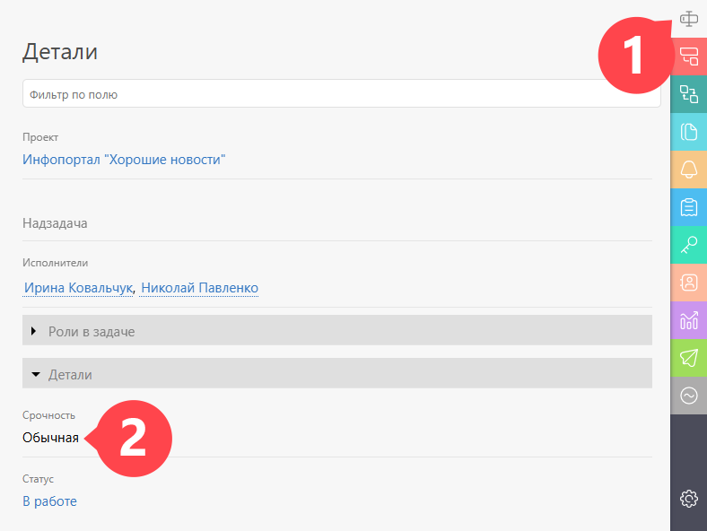

В ПланФиксе есть возможность реализовать разные способы задания приоритета задачам. Наиболее правильным мы считаем [ ручную сортировку](Ручная_сортировка_задач.md "Ручная сортировка задач") задач по приоритетам. 

Кроме этого, у задач в есть два стандартных уровня приоритета: обычная и срочная, которыми можно пользоваться: 

  

Еще один удобный вариант — сделать для этой цели [ пользовательское поле](Пользовательские_поля_задачи.md "Пользовательские поля задачи") (или даже несколько), проставлять в нем приоритет по своей любимой методике и потом сортировать/группировать в [ фильтрах](Фильтры_задач.md "Фильтры задач") и [ отчетах](Отчеты.md "Отчеты") задачи по этому полю. 

## Полезные ссылки

  * Конфигурация [Расстановка приоритетов](Расстановка_приоритетов.md "Расстановка приоритетов") демонстрирует один из вариантов организации работы по приоритетам.

  * Заметка [Ручная сортировка задач](https://planfix.com/ru/blog/ruchnaya-sortirovka-zadach/) в блоге ПланФикса.
