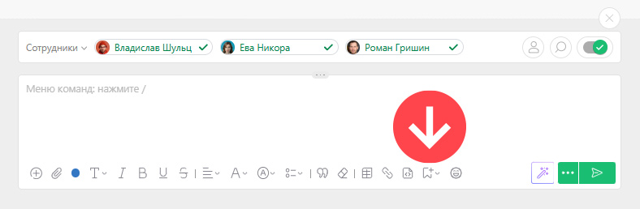
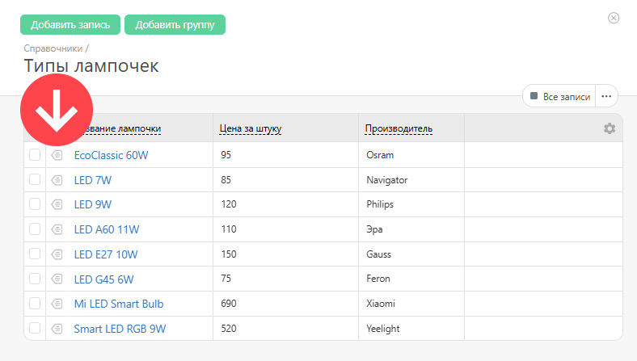
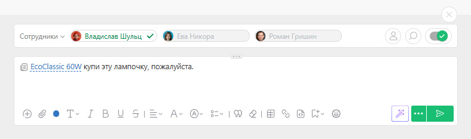
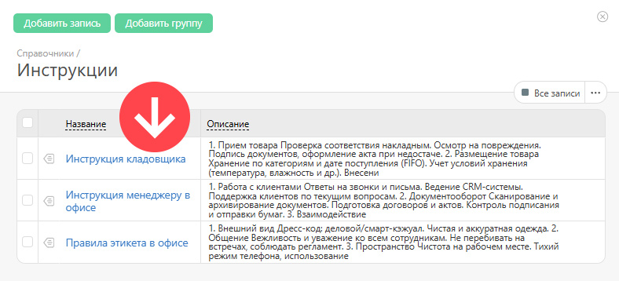
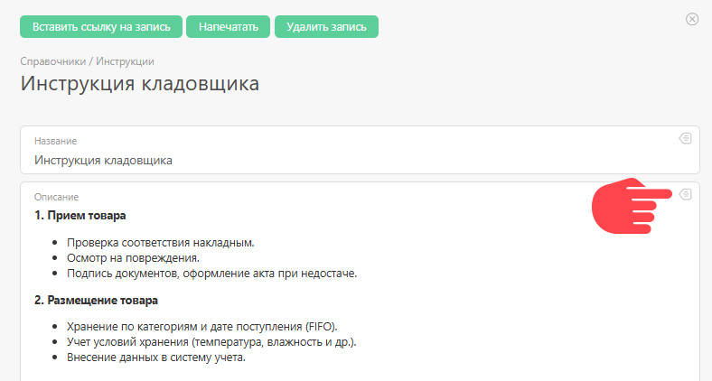
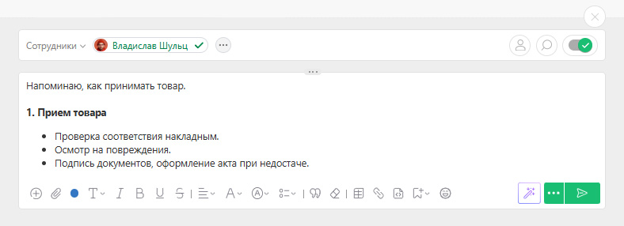

ПланФикс поддерживает два варианта добавления в [комментарий](Действия.md "Действия") или пользовательское поле типа [Текст](Текст.md "Текст") информации из [справочника](Справочники.md "Справочники"): 

  * Добавление ссылки на запись справочника

  * Добавление содержимого записи справочника

## Добавление ссылки на запись справочника

Ссылку на запись справочника обычно добавляют, чтобы поделиться с коллегами справочной информацией. Вставка ссылки на запись справочника в текст комментария происходит через специальную иконку на панели редактора: 

 _Изображение может отличаться в зависимости от выбранного[вида отображения](Лента_комментариев_задачи.md "Лента комментариев задачи") комментариев._

  

Клик по ней вызовет интерфейс выбора справочника и нужной записи из него. Для вставки ссылки на запись нажмите на иконку слева от нее: 

  

В комментарий вставится ссылка на эту запись. Текст самой ссылки будет совпадать со значением основного реквизита справочника: 

  

После добавления комментария клик по ссылке будет открывать окно с реквизитами записи справочника. 

### Обратите внимание

  * Если ссылка на справочник вставляется в текст комментария, то к этой записи справочника будет автоматически предоставлен доступ на чтение всем сотрудникам, уведомленным об этом комментарии. Это позволяет сэкономить время на предоставление доступа в явном виде в настройках записи справочника и открывает дополнительные возможности использования ПланФикса, например в качестве [менеджера паролей](https://planfix.com/ru/blog/menedzher-parolej-na-baze-planfiksa/).

  * Вставка ссылки на элемент справочника в пользовательское поле типа **Текст** не приводит к автоматическому предоставлению доступа кому бы то ни было.

## Добавление содержимого записи справочника

Этот способ добавления информации из справочника в текст комментария или пользовательского поля используется для быстрой публикации справочной информации и ознакомления с ней как пользователей, имеющих доступ в аккаунт, так и внешних [контактов](Контакты.md "Контакты") без доступа. 

Для вставки содержимого записи справочника в текст необходимо, как и в предыдущем случае, нажать на иконку на панели редактора, затем выбрать справочник и нужную запись в нем. После чего перейти в эту запись, кликнув по названию: 

  

Здесь необходимо нажать на иконку вставки напротив нужного реквизита записи справочника: 

  

Содержимое этого реквизита будет вставлено в текст комментария: 

  

Этот способ используется во множестве случаев. Например, когда получателю необходимо сообщить конкретное значение, сохраненное в справочнике, а не предоставлять ссылку, по которой он может ознакомиться с ним. 

## Важно

  * Справочники ПланФикса можно использовать как [базу знаний](https://planfix.com/ru/blog/kejsy-ispolzovaniya-planfiksa-baza-znanij/).
