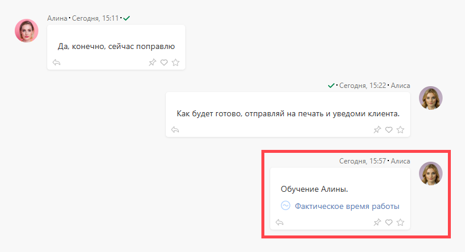

[ Аналитику](Аналитика.md "Аналитика") можно добавить: 

  * при создании или редактировании задачи

  * при создании или редактировании комментария

Как правило, аналитика добавляется в комментарии, так как отражает какие-то события, возникающие по ходу выполнения задачи. 

Для добавления аналитики: 

  * Нажмите "+" рядом с полем добавления комментария и выберете "Аналитика".

  * Укажите нужную аналитику и заполните необходимые поля.

  * Добавленная аналитика отобразится под текстом комментария:

