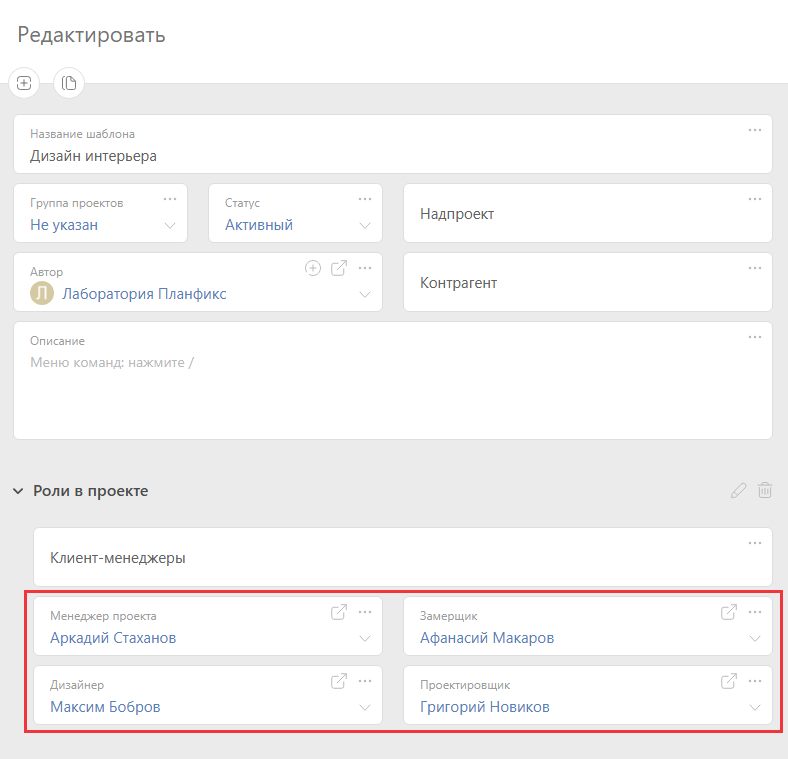
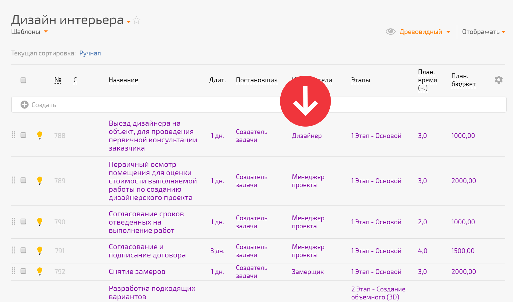

В шаблон каждого проекта можно добавить [ роли](Роли_в_проекте.md "Роли в проекте"). Например, в конфигурации **Управление проектами** в шаблон проекта добавлено 4 роли. Если в этих полях указать конкретных сотрудников, тогда при создании проекта они автоматически добавятся: 

  

Значения в шаблоне проекта можно оставит пустыми и заполнять их при создании проекта, когда, например, дизайнеров несколько, и для каждого проекта назначается свой. 

Тоже самое происходит и в шаблонах задач: в исполнителях можно указать не только конкретного сотрудника, но и роль проекта. В таком случае сотрудник, указанный в роли проекта, добавится в задачу: 

  

## Дополнительно

  * [ Как добавить свою пользовательскую роль в проект](Пользовательские_роли_в_проекте.md "Пользовательские роли в проекте")
