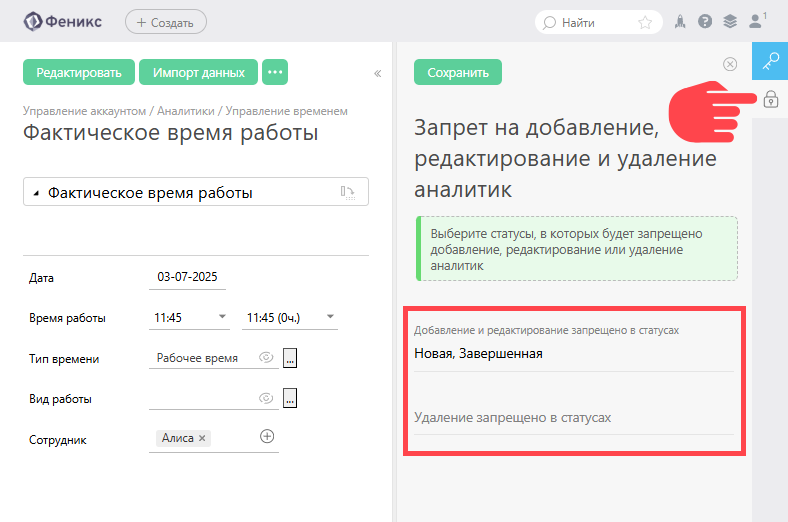

Вы можете запретить добавлять новую, редактировать существующую [аналитику](Аналитика.md "Аналитика") или удалять её в задачах, находящихся в определенных статусах. 

Стандартное использование этой возможности: ограничить ввод, корректировку или удаление данных аналитики "задним числом", например после завершения задачи или перевода ее на следующий этап. 

Для установки ограничений: 

  * Gерейдите в меню **Управление аккаунтом** — **Аналитики**.

  * Выберете аналитику и во вкладке "Ограничение на добавление" укажите нужный статус или статусы:

  

  * Сохраните настройки.
