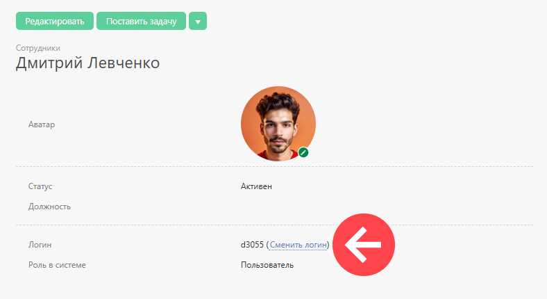

Инициировать изменение логина может [ администратор аккаунта](Роли_в_ПланФиксе.md "Роли в ПланФиксе"). Ему доступна специальная ссылка в карточке сотрудника, по нажатию на которую сотрудник получит на свою электронную почту письмо со ссылкой для установки нового логина и пароля: 

