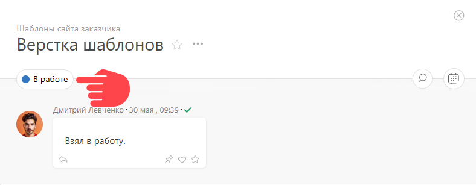
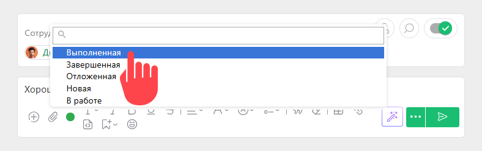

Самые распространенные ситуации, в которых у [ задачи](Задачи.md "Задачи") меняется статус: 

  * Исполнитель сделал то, что было необходимо по задаче, и меняет ее статус на "Выполненная".

  * Постановщик принимает результаты работы над задачей и меняет ее статус на "Завершенная".

## Смена статуса задачи

**Быстрый вариант**

В карточке задачи кликните на текущий статус и выберите нужный из появившегося списка: 

 _Изображение может отличаться в зависимости от выбранного[вида отображения](Лента_комментариев_задачи.md "Лента комментариев задачи") комментариев._

  

**Альтернативный вариант**

  * Создаем [ новый комментарий](Добавление_комментария.md "Добавление комментария").

  * Пишем краткое пояснение по выполненной работе (не обязательно).

  * Выбираем один из доступных статусов:

 _Изображение может отличаться в зависимости от выбранного[вида отображения](Лента_комментариев_задачи.md "Лента комментариев задачи") комментариев._

  * Сохраняем комментарий.

## Важно

  * В зависимости от вашей роли в системе, вам может быть доступно разное число статусов. Например, исполнителю доступны только статусы **В работе** и **Выполненная** , а постановщик задачи видит статусы **Черновик** , **Отмененная** и **Завершенная**. Также на видимость статусов в разных ситуациях влияют [ настройки правил перехода между статусами](Настройка_правил_перехода_между_статусами.md "Настройка правил перехода между статусами").
