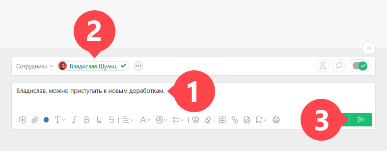

[Комментарий](Комментарии.md "Комментарии") — это самый простой вид действия в задаче. 

Чтобы добавить комментарий к задаче: 

  * Создаем [новый комментарий](Добавление_комментария.md "Добавление комментария").

  * Добавляем в него текст.

  * Выбираем из списка участников задачи тех, кого хотим [уведомить](Кто_будет_уведомлен_о_комментарии.md "Кто будет уведомлен о комментарии") об этом комментарии.

  * Нажимаем кнопку **Добавить** :

 _Изображение может отличаться в зависимости от выбранного[вида отображения](Лента_комментариев_задачи.md "Лента комментариев задачи") комментариев._

В ленту задачи добавится новый комментарий, а все участники задачи, которых вы выбрали, получат уведомление об этом в [ Хронике](Хроника.md "Хроника").
