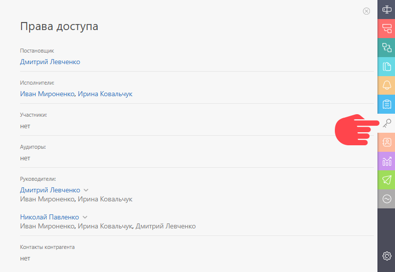

Если у сотрудника есть доступ к какой-то из задач проекта, это совершенно не означает, что он будет иметь доступ к другим задачам этого же проекта. Доступ к каждой конкретной задаче определяется [ правилами](Права_доступа_в_ПланФиксе.md "Права доступа в ПланФиксе"). 

Другие сотрудники и клиенты, подключенные к Вашему аккаунту, не имеют доступа к задаче. Если Вы хотите их подключить к работе над задачей - добавьте их в качестве участника или исполнителя на [ панели Детали задачи](Панель_Детали.md "Панель Детали"). 

Увидеть, кто имеет доступ к задаче, можно на [панели Права доступа](Панель_Права_доступа.md "Панель Права доступа"): 

