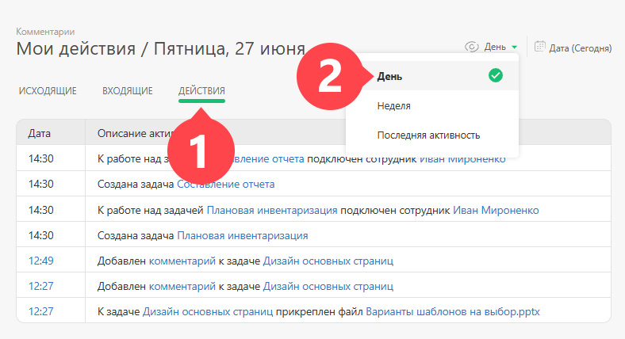
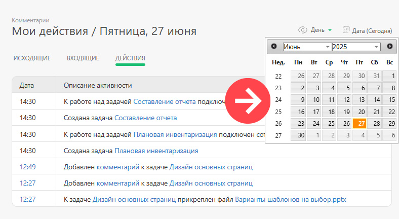

Перейдите в свою карточку сотрудника и выберите в меню слева вкладку [Комментарии](Комментарии.md "Комментарии"): 

Вы увидите список входящих и исходящих сообщений, а также свои действия за текущий день. Самые последние находятся сверху. Можно выбрать вид отображения "День" или "Неделя": 

  

В календаре можно перемещаться по дням или неделям с помощью стрелок и быстро переходить на нужную дату: 

