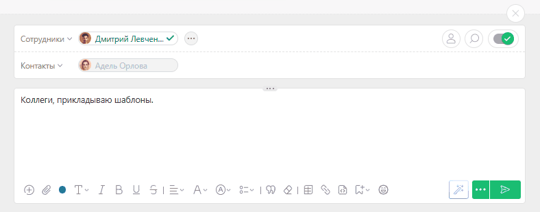

К задаче в ПланФиксе можно прикрепить [ файл](Файлы.md "Файлы"), который хранится локально, или ссылку на интернет-документ. Если выбран локальный файл, он будет загружен на сервер ПланФикса. 

Существует несколько способов прикрепления файла. 

## Быстрое добавление файла

Добавление файла перетаскиванием — cамый простой и быстрый способ: 

  * Перетаскивание файла **из диалогового окна компьютера** :

  

  * Перетаскивание файла из другой вкладки ПланФикса: 

    * из задачи, открытой в соседней вкладке нужно взять файл с ее панели “Документы” и перетащить в нужную задачу.

    * перетащить файл в задачу из раздела [Документы](Документы.md "Документы").

  * Перетаскивание ссылки. Обратите внимание: перетянутая в задачу ссылка прикрепляется к комментарию как файл типа **Внешняя ссылка**.

## Прикрепление файла комментарием

  * Заходим в нужную задачу;

  * Создаем [ новый комментарий](Добавление_комментария.md "Добавление комментария");

  * Пишем сопровождающий текст в поле **Комментарий** (не обязательно);

  * В редакторе текста нажимаем иконку **Скрепка** , чтобы добавить файл:

  * В появившемся окне необходимо выбрать источник добавления файла, затем выбрать нужный файл или вставить ссылку.

  * Добавляем список пользователей, которых необходимо уведомить о загруженном файле (если необходимо).

  * Сохраняем комментарий.

## Важно

  * Файлы начинают загружаться сразу при добавлении, а не при сохранении комментария.

  * Если какой-то из файлов не загрузился, можно перезагрузить конкретно его, на остальные файлы это никак не влияет.

  * ПланФикс поддерживает [версионность файлов](Ведение_версий_документа.md "Ведение версий документа"). Если файл с таким именем уже существует в текущем проекте, система обнаружит это и предложит пользователю выбрать один из вариантов: сохранить как новую версию, переименовать или прикрепить загруженный ранее файл.
