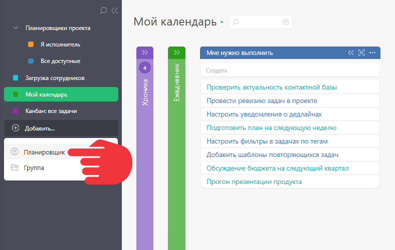
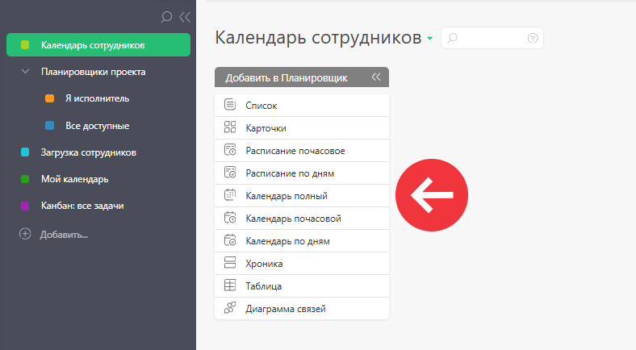

Новый планировщик создается в одноименном разделе. 

  * На панели слева нажмите "Добавить" и выберите Планировщик:

  

  * В появившемся окне укажите название нового планировщика.

  * После этого можно переходить к созданию [нужных списков](Виды_списков_планировщика.md "Виды списков планировщика"):

