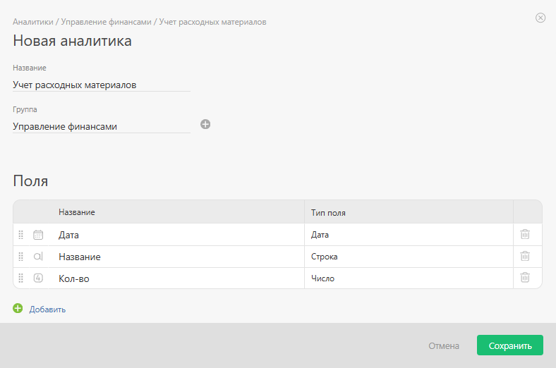
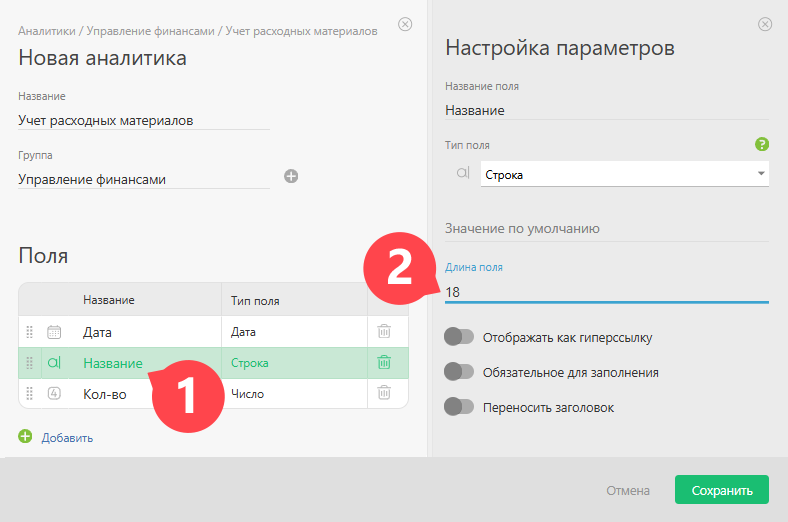

Новая [аналитика](Аналитика.md "Аналитика") может быть создана [ администратором аккаунта](Роли_в_ПланФиксе.md "Роли в ПланФиксе") в разделе **«Управление аккаунтом»** — **«Аналитики»**. 

Как и большинство других сущностей ПланФикса, аналитики объединены в группы. Вы можете создать аналитику внутри имеющихся групп или создать свою группу. 

## Как создать аналитику

  * Зайдите в нужную группу аналитик, нажмите кнопку «Добавить аналитику» на панели инструментов.

  * В появившейся форме необходимо задать название аналитики и описать реквизиты, которые будут в нее входить:

  

  * Для каждого реквизита укажите название и выберете из списка тип информации, которую он будет содержать.

  * Список поддерживаемых типов реквизитов практически полностью совпадает с [типами пользовательских полей](Типы_пользовательских_полей.md "Типы пользовательских полей").

  * [Вычисляемые поля в аналитиках](Вычисляемые_поля_в_аналитиках.md "Вычисляемые поля в аналитиках") также устроены похожим образом, но при этом позволяют оперировать значениями из других реквизитов аналитики и используемых в ней справочников.

  * Для большинства реквизитов можно указать длину поля, в которое будет вводиться информация:

  

  * После создания аналитики можно увидеть, как она будет отображаться при добавлении.
