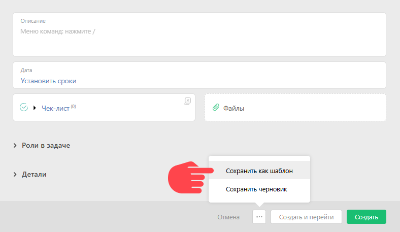

Для того, чтобы создать [шаблон задачи](Шаблоны_задач.md "Шаблоны задач") нужно: 

  * В разделе **Задачи** на панели слева открыть вкладку **Шаблоны**

  * Нажать кнопку **Новый шаблон задачи**.

## Альтернативный вариант

При создании обычной задачи в расширенной форме, рядом с кнопками **Создать** и **Создать и перейти** , нажать на кнопку с троеточием и выбрать **Сохранить как шаблон**. 

  

Задайте в задаче все параметры, которые хотите сохранить в шаблоне и нажмите на эту ссылку — будет сохранен шаблон с именем, которое вы задали в названии задачи. 

## Важно

  * Все шаблоны находятся в разделе **Задачи** во вкладке **Шаблоны** на панели слева.

  * Сохраненный шаблон можно отредактировать, добавить или убрать дополнительные параметры.
