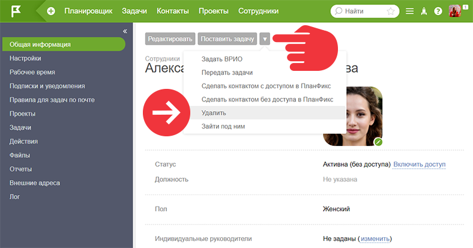

**Важно:**

  * При увольнении мы рекомендуем не удалять сотрудника, а провести процедуру [ одним из доступных способов](Как_уволить_сотрудника.md "Как уволить сотрудника").

  * Перед удалением сотрудника [ передайте его активные задачи на другого сотрудника](Передача_задач_другому_сотруднику.md "Передача задач другому сотруднику").

  

Удалить сотрудника может [ администратор аккаунта](Роли_в_ПланФиксе.md "Роли в ПланФиксе") либо [ сотрудник, управляющий оплатой аккаунта](Как_дать_сотруднику_права_на_оплату_аккаунта.md "Как дать сотруднику права на оплату аккаунта"). 

  

Для того, чтобы удалить сотрудника, необходимо: 

1\. Зайти в раздел [ Сотрудники](Сотрудники_и_компания.md "Сотрудники и компания")

2\. Кликнуть на сотрудника, которого собираетесь удалить 

3\. В карточке сотрудника, в меню дополнительных операций выбрать пункт **Удалить** : 

