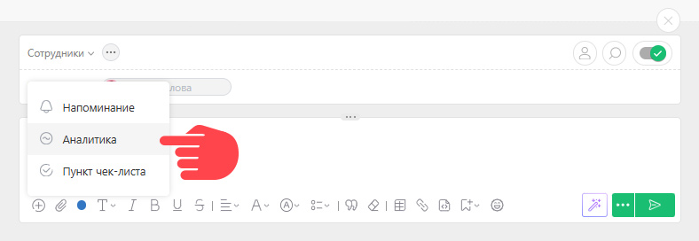
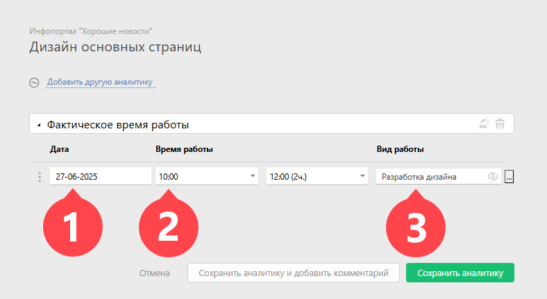

Используя [комментарий](Комментарии.md "Комментарии"), можно указать затраченное на задачу время, но предварительно необходимо установить конфигурацию ПланФикса [Учет рабочего времени](Учет_рабочего_времени.md "Учет рабочего времени"). Затем: 

  * Создаем [новый комментарий](Добавление_комментария.md "Добавление комментария").

  * Добавляем текст комментария (не обязательно), описывающий суть проведенной работы, и кликаем на плюс, чтобы добавить [Аналитику](Аналитика.md "Аналитика"):

 _Изображение может отличаться в зависимости от выбранного[вида отображения](Лента_комментариев_задачи.md "Лента комментариев задачи") комментариев._

  * В развернувшимся списке выбираем аналитику "Фактическое время работы".

  * Появляется несколько полей, в которых указываем: 

    * Дату

    * Время

    * Вид работы (выбирается из справочника "Виды работ"):

  

  * Сохраняем комментарий.

Вся информация, добавленная таким образом, будет доступна в отчете по учету рабочего времени (Отчеты —Управление временем — Отчет:тайм-трекинг). 

## Дополнительная информация

  * Настроить другой вид учета рабочего времени можно при помощи функционала [Аналитика](Аналитика.md "Аналитика") и [Отчеты](Отчеты.md "Отчеты"). Пример использования этого функционала можно посмотреть в статье [Как настроить свою систему учета оплаты труда в ПланФиксе](http://planfix.livejournal.com/1009.html).

  * В качестве альтернативы ручному вводу аналитики, вы можете использовать [внутренний таймер ПланФикса](Таймер.md "Таймер") или [специальное расширение-таймер](https://planfix.com/ru/blog/tajmer-dlya-ucheta-zatrachennogo-vremeni) для автоматического добавления аналитики "Фактическое время работы" в выбранную задачу.
