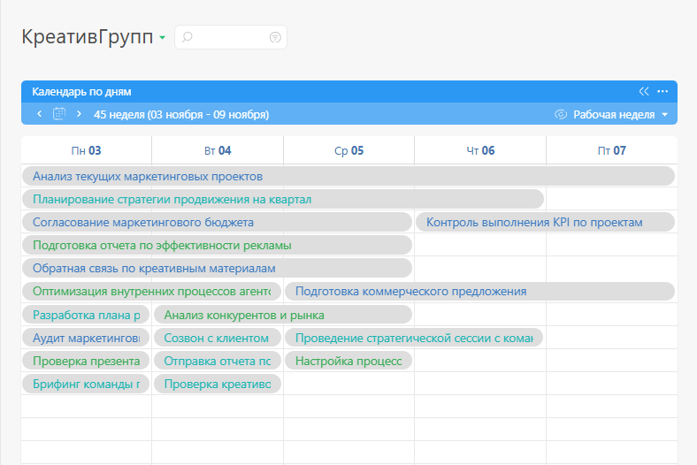

В [ виде отображения](Виды_списков_планировщика.md "Виды списков планировщика") "Календарь по дням" отображаются даты завершения задач. Каждая задача представляет собой прямоугольник, расположенный в столбце с датой ее завершения. Если у задачи помимо даты завершения указана и дата начала, то она имеет вид полоски, протяженностью от столбца с датой начала задачи до столбца с датой ее завершения. 

## Параметры настройки списка типа "Календарь по дням"

В параметрах списка вы можете самостоятельно определить, какие задачи будут в нем отображаться, и настроить различные варианты их отображения. 

Доступны следующие параметры: 

  * [ Тип объектов, отображающихся в списке ](Отображение_объектов_в_списке_планировщика.md "Отображение объектов в списке планировщика")

  * [Параметры отбора объектов](Параметры_отбора_объектов.md "Параметры отбора объектов")

  * Настройки календарной сетки

  * Ссылка для [ экспорта календаря в формате iCal](Экспорт_календаря_в_формате_iCal.md "Экспорт календаря в формате iCal")

  * Блок синхронизации с [Google Contacts](Google_Contacts.md "Google Contacts")

  * [Цвет заголовка списка](Цвет_заголовка_списка.md "Цвет заголовка списка")

  * Признак [Использовать полную форму](Использовать_полную_форму.md "Использовать полную форму")

  * Признак [Автоматически сворачивать пустой список](Автоматически_сворачивать_пустой_список.md "Автоматически сворачивать пустой список")

  * [ Отображение карточки задачи / контакта](Настройка_отображения_карточки_в_планировщике.md "Настройка отображения карточки в планировщике")
