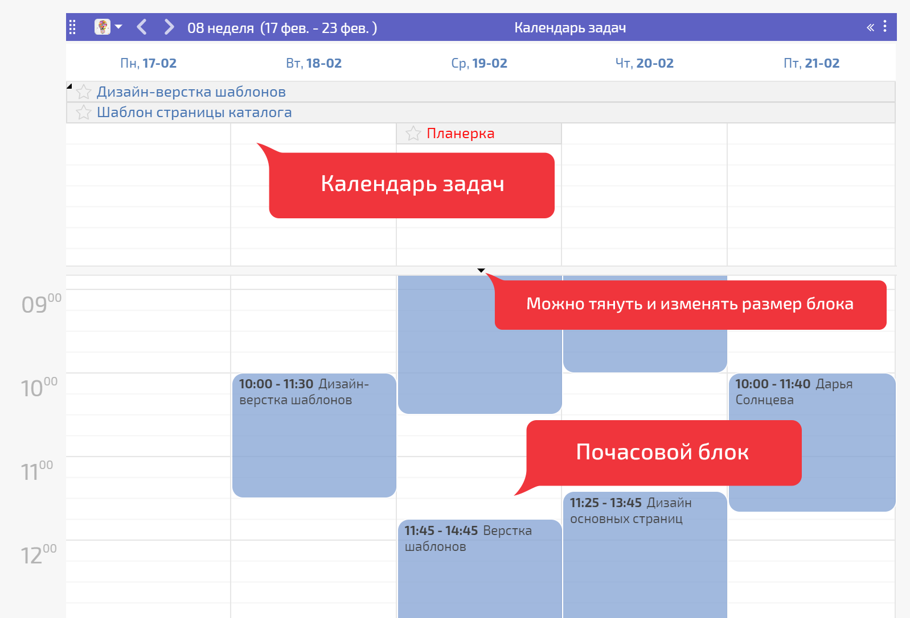

Этот [ вид отображения списка](Виды_списков_планировщика.md "Виды списков планировщика") Планировщика объединяет в себе виды [Календарь по дням](Календарь_по_дням.md "Календарь по дням") и [Календарь почасовой](Календарь_почасовой.md "Календарь почасовой"): 

  

Этот вид удобен, когда вам в одном списке необходимо видеть общий список задач на день и планировать почасовую загрузку по ним. 

## Важно

  * Если в календаре установлен вид отображения «месяц», то в нём будут отображаться только задачи без аналитик. Аналитики в таком виде календаря отображаются только при клике на конкретный день месяца.

  * В календаре одновременно может отображаться 150 задач.

  * Рекомендуем использовать этот вид календаря только для работы с длительными задачами, но не для задач на каждый день.
