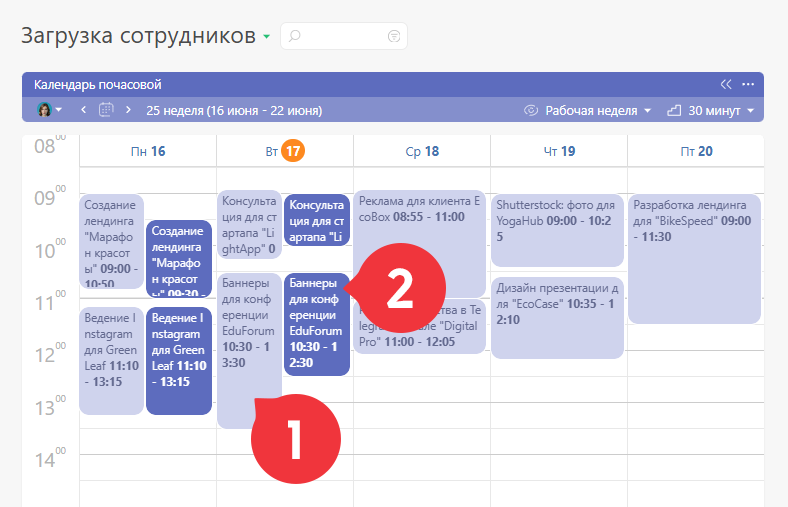
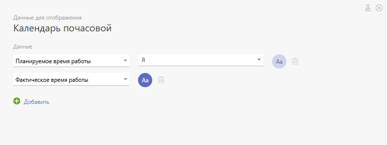

В [ виде отображения](Виды_списков_планировщика.md "Виды списков планировщика") **Календарь почасовой** (его часто называют "почасовой блок") отображаются [ аналитики](Аналитика.md "Аналитика"), содержащие реквизит типа [Период времени](Период_времени.md "Период времени"). Примерами таких аналитик являются стандартные аналитики ПланФикса [ Планируемое и Фактическое время работы](Управление_временем.md "Управление временем"). 

## Параметры настройки списка типа "Календарь почасовой"

В разделе "Данные для отображения" в параметрах списка вы можете самостоятельно определить, какие именно аналитики будут в нем отображаться: 

  

Обратите внимание, что одновременно в одном списке могут отображаться аналитики нескольких типов. При этом аналитика каждого типа будет отображаться другим цветом, который вы также можете задавать самостоятельно. 

Помимо этого, в настройках списка доступны следующие параметры: 

  * [ Тип объектов, отображающихся в списке ](Отображение_объектов_в_списке_планировщика.md "Отображение объектов в списке планировщика")

  * [Параметры отбора объектов](Параметры_отбора_объектов.md "Параметры отбора объектов")

  * Настройки календарной сетки

  * Ссылка для [ экспорта календаря в формате iCal](Экспорт_календаря_в_формате_iCal.md "Экспорт календаря в формате iCal")

  * Блок синхронизации с [Google Contacts](Google_Contacts.md "Google Contacts")

  * [Цвет заголовка списка](Цвет_заголовка_списка.md "Цвет заголовка списка")

  * Признак [Использовать полную форму](Использовать_полную_форму.md "Использовать полную форму")

  * Признак [Автоматически сворачивать пустой список](Автоматически_сворачивать_пустой_список.md "Автоматически сворачивать пустой список")

  * [ Отображение карточки задачи / контакта](Настройка_отображения_карточки_в_планировщике.md "Настройка отображения карточки в планировщике")

## Полезно

  * [ Работа с почасовым блоком Планировщика](Работа_с_почасовым_блоком.md "Работа с почасовым блоком")

  * [Как видеть занятость сотрудников без доступа к их задачам](Как_видеть_занятость_сотрудников_без_доступа_к_их_задачам.md "Как видеть занятость сотрудников без доступа к их задачам")

  * Частным случаем почасового календаря является [Календарь напоминаний](Календарь_напоминаний.md "Календарь напоминаний"), позволяющий отобразить [напоминания](Напоминания.md "Напоминания"), которые вы получили или должны будете получить в будущем.

  * Используя почасовой календарь вы можете организовать управление ресурсами компании, например, переговорными комнатами. Кейс по настройке описан в [блоге](https://planfix.com/ru/blog/upravlenie-resursami-kompanii-zaranee-broniruem-peregovornuyu-komnatu/).
