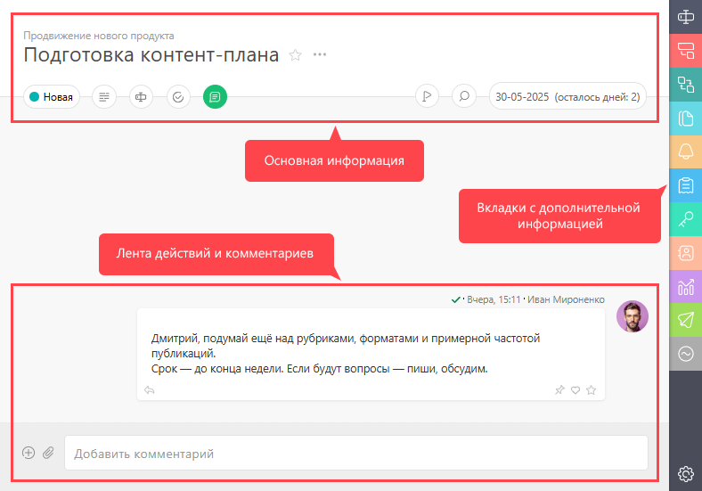

**Карточка задачи** содержит всю информацию о [ задаче](Задачи.md "Задачи"), а также ленту действий по ней. Карточку можно условно разбить на следующие блоки: 

  * [Основная информация по задаче](Основная_информация_по_задаче.md "Основная информация по задаче")

  * [ Вкладки (Панель дополнительной информации)](Вкладки.md "Вкладки")

  * [Лента действий по задаче](Лента_действий_по_задаче.md "Лента действий по задаче")

  * [Настройка вида отображения карточки задачи](Настройка_вида_отображения_карточки_задачи.md "Настройка вида отображения карточки задачи")

  

  

## Полезно

  * На панели с основной информацией можно также [ отображать дополнительные пользовательские поля задачи](Отображение_пользовательских_полей_при_просмотре_задачи.md "Отображение пользовательских полей при просмотре задачи").
