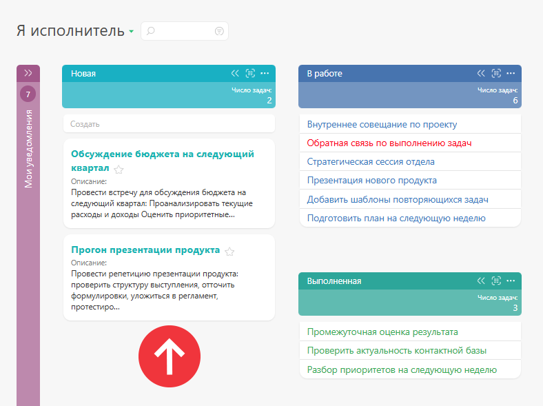
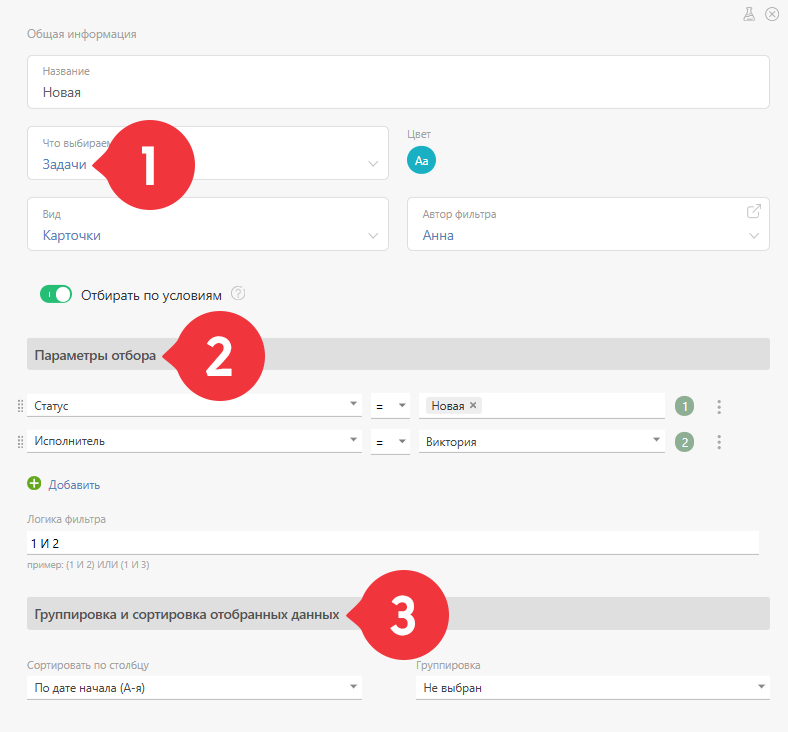

Выбор этого [ вида отображения списка](Виды_списков_планировщика.md "Виды списков планировщика") приводит к отображению задач и контактов в виде карточек: 

## Параметры настройки списка типа "Карточки"

При [ создании](Как_создать_планировщик.md "Как создать планировщик") или редактировании списка планировщика типа **Карточки** , вы можете настроить следующие параметры, влияющие на его функциональность и внешний вид: 

  

Доступны следующие параметры: 

  * [ Тип объектов, отображающихся в списке ](Отображение_объектов_в_списке_планировщика.md "Отображение объектов в списке планировщика")

  * [Параметры отбора объектов](Параметры_отбора_объектов.md "Параметры отбора объектов")

  * [Цвет заголовка списка](Цвет_заголовка_списка.md "Цвет заголовка списка")

  * Признак [Открывать в новой вкладке](Открывать_в_новой_вкладке.md "Открывать в новой вкладке")

  * Признак [Скрывать поле создания нового объекта](Скрывать_поле_создания_нового_объекта.md "Скрывать поле создания нового объекта")

  * Признак [Автоматически сворачивать пустой список](Автоматически_сворачивать_пустой_список.md "Автоматически сворачивать пустой список")

  * Признак [ Отображать блок итогов](Итоги_в_Планировщике.md "Итоги в Планировщике")

  * [ Отображение карточки задачи / контакта](Настройка_отображения_карточки_в_планировщике.md "Настройка отображения карточки в планировщике")

## Полезные ссылки

  * [Карточки в Планировщике ПланФикса: аналог Trello на русском языке](https://planfix.com/ru/blog/analog-trello-na-russkom/)
