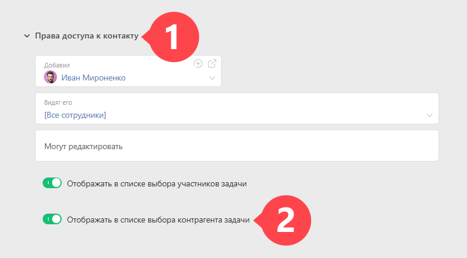

**Контрагент** — это реквизит [Задачи](Задачи.md "Задачи"), который в общем случае содержит ссылку на [ Контакт](Контакты.md "Контакты") (частное лицо или компанию), для которого производятся работы по этой задаче. Это удобным образом связывает задачу и контакт, поэтому мы настоятельно рекомендуем использовать этот реквизит, особенно если вы работаете с клиентами, поставщиками и подрядчиками. 

Наличие такой связи, в частности, позволяет удобно отображать задачу в чек-листе [ карточки контакта](Карточка_контакта.md "Карточка контакта"). Также этот реквизит удобно использовать для отбора задач нужного контакта в [ фильтрах](Фильтры_задач.md "Фильтры задач"), [ Планировщике](Планировщик.md "Планировщик"), [ отчетах](Отчеты.md "Отчеты") и других разделах ПланФикса. [Автоматические сценарии](Автоматические_сценарии.md "Автоматические сценарии") позволяют адресоваться к контрагенту при совершении различных операций над задачами. 

## Отображение контрагента в списке

В списке возможных контрагентов задачи отображаются контакты, у которых активирован признак **Отображать в списке выбора контрагента задачи** : 

  

Как правило, такой признак по умолчанию приобретают все контакты-юридические лица, добавленные в систему по [ шаблону Компании](Шаблоны_контактов.md "Шаблоны контактов"). Если вы работаете с клиентами - физическими лицами, имеет смысл установить этот признак в шаблоне контакта, который вы используете. Тогда все создаваемые по этому шаблону контакты будут автоматически отображаться в списке контрагентов при создании задач. 

## Быстро создать контрагента

  * В задаче есть возможность [ быстро создавать нового контрагента](Быстрое_создание_контрагента_в_задаче.md "Быстрое создание контрагента в задаче"). Это удобно при создании новой задачи (заявки, заказа) "на лету". В шаблоне задачи вы можете указать, по какому шаблону будут создаваться контрагенты, добавляемые в этой задаче. Подробнее об этом можно узнать в [ справке](Быстрое_создание_контрагента_в_задаче.md "Быстрое создание контрагента в задаче").

## Важно

  * Контрагентом нельзя сделать контакта, к которому нет доступа при создании задачи через полную форму. Исключением являются следующие ситуации: 

    * Когда задача создается в проекте, где контрагентом является этот контакт (и при создании поле контрагент не изменялось).

    * Вы редактируете ранее созданную задачу, где контрагентом является этот контакт (и при редактировании поле контрагент не изменялось).

  * Если компания у контакта-отправителя письма не задана, тогда он сам будет контрагентом в задаче.

  * При смене контрагента в проекте — во всех задачах проекта, где контрагент был такой же — он меняется на нового.

  * При смене контрагента в надзадаче — во всех подзадачах, где контрагент был такой же — он меняется на нового.
