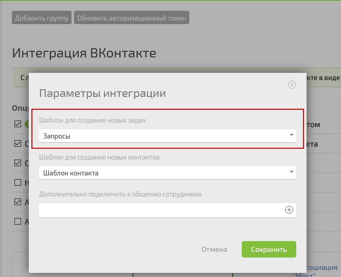

[Конфигурация Служба поддержки](Конфигурация_Служба_поддержки.md "Конфигурация Служба поддержки") позволяет принимать сообщения от клиентов по разных каналам связи. При поступлении нового сообщения в системе автоматически создается задача-диалог и карточка клиента. 

  

**Важно:** Для корректной работы конфигурации при подключении канала необходимо указать шаблон задачи **Запросы** , как это показано на примере подключения интеграции с ВКонтакте: 

Настройте прием заявок из нужных каналов связи по этой [ инструкции](Как_настроить_прием_заявок_из_разных_каналов.md "Как настроить прием заявок из разных каналов").
