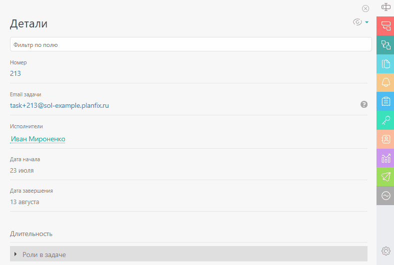
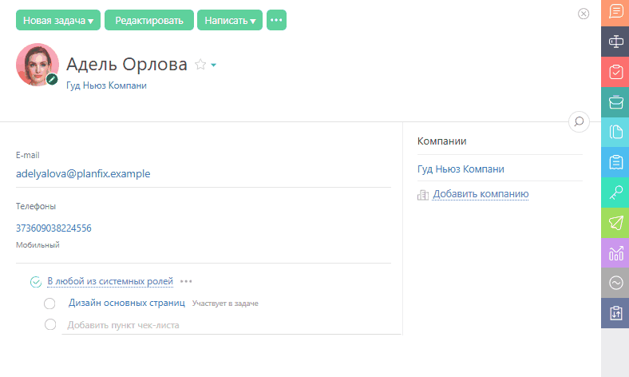

[Контакты](Контакты.md "Контакты") и [Задачи](Задачи.md "Задачи") содержат поля, в которых хранится вся информация. Поля могут быть системными и [пользовательскими](Пользовательские_поля.md "Пользовательские поля"). Их содержимое легко скопировать в буфер обмена. Для этого кликните на название поля: 

  * **в Деталях** Задачи или Контакта:

  

  * **на странице** Задачи или Контакта:

