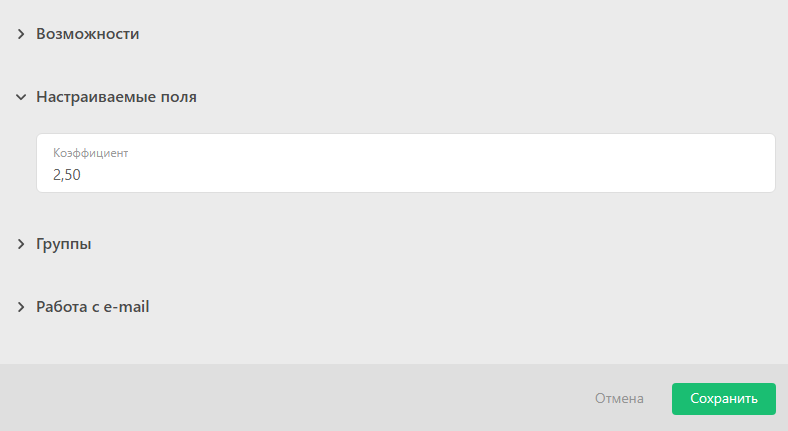

Личный коэффициент сотрудника используется для повышения или понижения базового тарифа за выполненную работу. Подробнее о тарификации работы смотрите в [идеологии учета](Идеология_учета_в_конфигурации_Учет_рабочего_времени.md "Идеология учета в конфигурации Учет рабочего времени"). 

Коэффициент сотрудника устанавливается в его карточке. Для этого перейдите в раздел **Сотрудники** — **Нужный сотрудник** — **Редактировать** — **Настраиваемые поля** — **Коэффициент** : 

