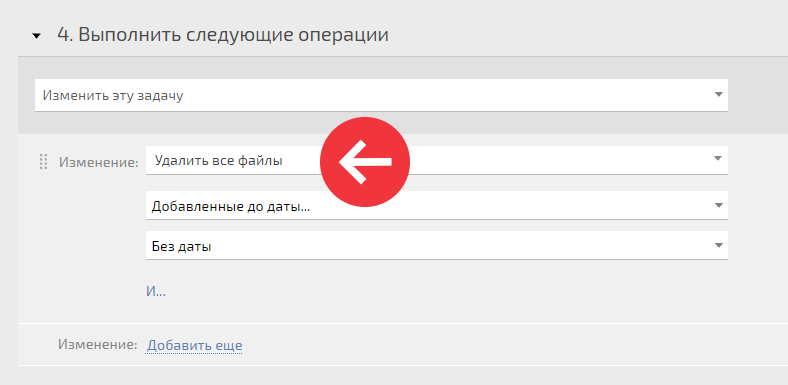
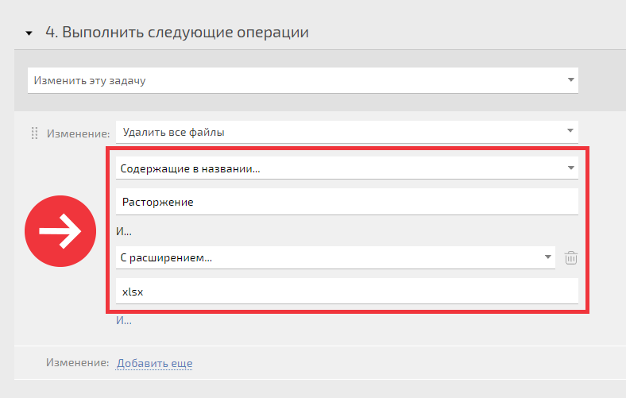

Существует несколько способов массово удалить большое количество документов. Например, чтобы освободить занимаемое неактуальными документами дисковое пространство: 

  * Выбрать нужные документы в разделе [Документы](Документы.md "Документы") и [ удалить их](Удаление_документа.md "Удаление документа").

  * В разделе [Проекты](Проекты.md "Проекты"), [Задачи](Задачи.md "Задачи") или [Контакты](Контакты.md "Контакты") выбрать все или часть задач (контактов) (например, отобрав их по нужным условиям при помощи [ фильтра](Фильтры_задач.md "Фильтры задач")) и выбрать [ массовую операцию](Массовые_действия_над_задачами.md "Массовые действия над задачами") "Удалить все файлы". Этот вариант удобен сочетанием возможностей выбора проектов, задач или контактов, которые могут содержать неактуальную информацию и указанием конкретной даты актуальности, до которой файлы можно удалить.

  * Массово удалить документы до определенной даты можно и с помощью автоматического сценария, который запускается при заранее определенных условиях:

  

  * Автоматическим сценарием можно удалить файлы, содержащие в названии конкретное слово, а также файлы определенного расширения:

