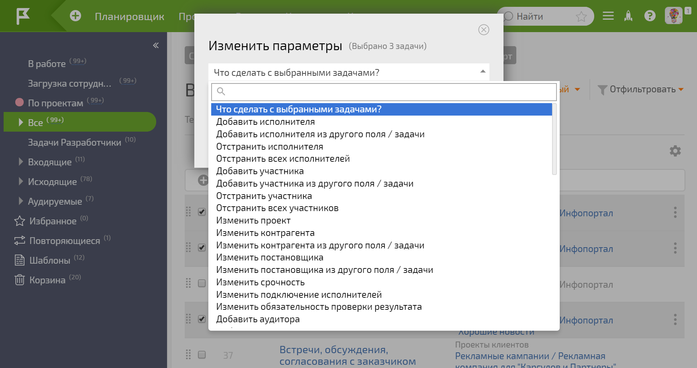

В [ПланФиксе](Описание_возможностей.md "Описание возможностей") реализован функционал массовых операции. Пользователи его используют для массовых изменений в сущностях ПланФикса: 

  * [задачах](Массовые_операции_над_задачами.md "Массовые операции над задачами"),

  * [контактах](Массовые_операции_над_контактами.md "Массовые операции над контактами"),

  * [проектах](Массовые_операции_над_проектами.md "Массовые операции над проектами"),

  * [отчетах по задачам](Массовые_операции_в_отчетах.md "Массовые операции в отчетах").

  

Например, с помощью [ фильтра задач](Фильтры_задач.md "Фильтры задач") можно отобрать нужные задачи и массово изменить в них исполнителя, проект, надзадачу и другое: 

