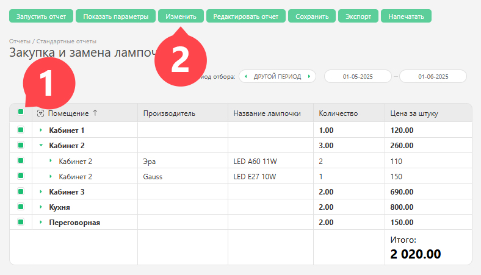

В [ отчетах](Отчеты.md "Отчеты") есть возможность галочками выбирать нужные задачи, а затем массовым действием производить в них изменения. Для этого сформируйте отчёт, отметьте нужные задачи и нажмите кнопку **Изменить** : 

  

Такая возможность позволяет проводить операции над задачами, отобранными в отчет по сложному сочетанию факторов и/или данных, хранящихся в разных объектах. Для более простых случаев можно использовать [массовые операции над задачами](Массовые_операции_над_задачами.md "Массовые операции над задачами"). 

## Важно

  * В отчетах массово можно изменять не только задачи, но и контакты.
