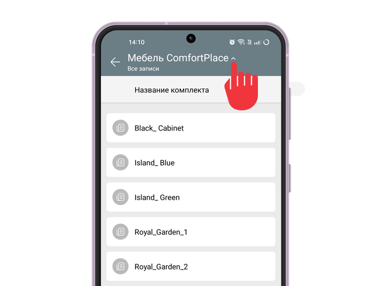

В разделе **Справочники** можно быстро просматривать и редактировать информацию в записях существующих справочников. Откройте меню **Еще** и выберите **Справочники** : 

  

В разделе отображается список доступных справочников. 

  * Нажмите на справочник, чтобы просмотреть его записи.

  * Двигайте (свайп) страницу вправо и влево, чтобы просматривать данные полей записей, не открывая их.

  * Нажмите на название справочника, чтобы применить фильтр (если он есть):

  

Нажмите на запись справочника, чтобы открыть ее. Нажмите на поле, чтобы отредактировать данные, которые в нем содержатся: 

  

## Важно

Создать новый справочник, фильтр и запись справочника, поменять структуру и импортировать данные из справочника можно только в веб-версии ПланФикса.
