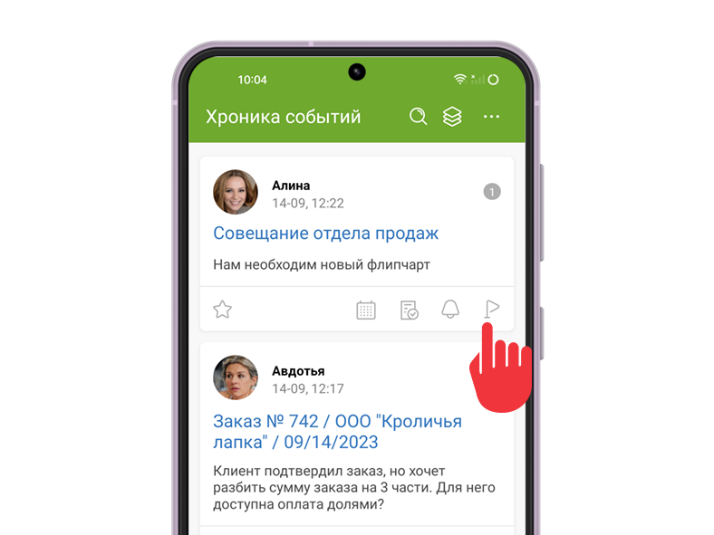
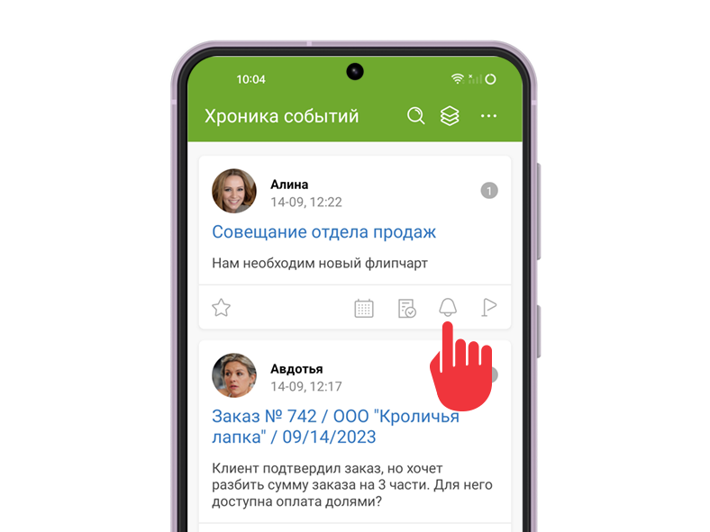
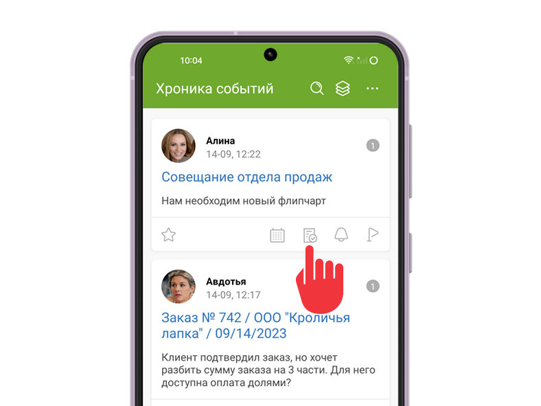
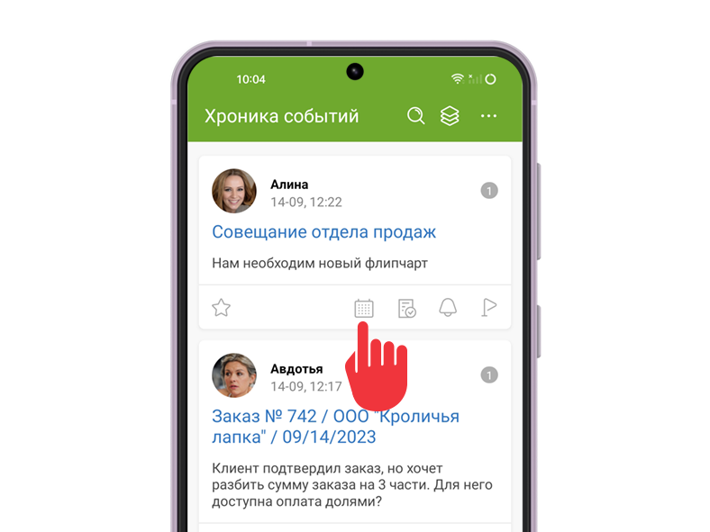
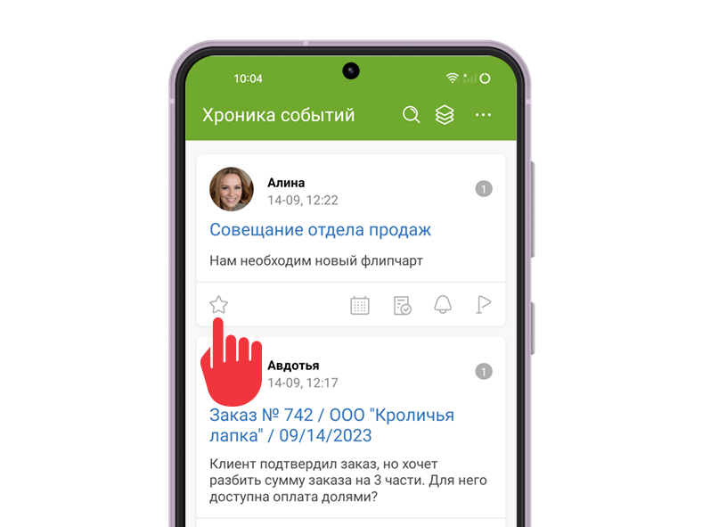
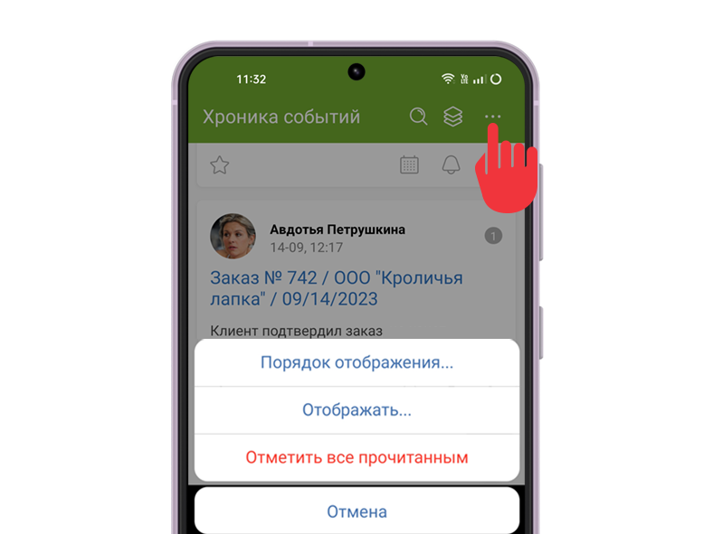

[Хроника](Хроника.md "Хроника") — раздел мобильного приложения, в котором отображается список ваших уведомлений о событиях в задачах и контактах ПланФикса. С помощью Хроники вы сможете быстро просмотреть или поработать с ними. 

Из карточки каждого события можно перейти прямо в задачу или контакт, чтобы ознакомиться с деталями, написать комментарий, прикрепить файл, аналитику или напоминание. 

Список часто совершаемых действий в Хронике: 

  * Отметить прочитанным

  * Добавить напоминание

  * Завершить задачу

  * Изменить сроки задачи

  * Добавить в Избранное

  * Создать задачу

  * Настроить Хронику

## Отметить прочитанным

В нижней части каждого блока события **Хроники** расположено меню операций. Для того, чтобы отметить событие прочитанным, нажмите на **Флажок**. Прочитанное событие исчезает из **Хроники** (если включен режим отображения непрочитанных событий): 

  * Операцию можно отменить. В течение нескольких секунд внизу экрана будет отображаться кнопка **Отмена**.

  * В настройках аккаунта в веб-версии можно включить функцию **Дополнительное подтверждение прочтения события в Хронике**.

  * Флажок отметит прочитанными все комментарии в карточке задачи или контакта.

## Добавить напоминание

Нажмите на **Колокольчик** в меню операций, чтобы добавить напоминание к задаче: 

  

  * После добавления напоминания событие считается прочитанным и исчезает из Хроники.

## Завершить задачу

Нажмите на иконку с изображением галочки, чтобы быстро завершить задачу и отметить событие прочитанным: 

  

## Изменить сроки задачи

Нажмите на **Календарь** , чтобы изменить дату начала, дату планируемого завершения или длительность задачи: 

  

  * После сохранения изменений, событие считается прочитанным и исчезает из **Хроники**.

## Добавить в Избранное

В **Хронике** можно добавить задачу или контакт в раздел **Избранное**. Для этого нажмите на **Звездочку** и выберите нужный значок: 

  

## Создать задачу

В разделе **Хроника** доступно создание новых задач. Для того, чтобы создать новую задачу, нажмите на **Плюс**. В данный момент существует 3 способа создания: 

  * Голосовой ввод

  

  * Сокращенная карточка

  

  * Полная карточка

  

## Настроить Хронику

Нажмите на **Меню** в правом верхнем углу **Хроники** , чтобы открыть список возможных настроек и операций: 

  

В меню можно: 

  * Настроить **Порядок отображения** событий в Хронике: сначала новые (используется по умолчанию) или сначала старые.

  * Настроить тип отображаемых событий. В пункте меню **Отображать** доступны варианты: непрочитанные события и все события.

  * **Отметить прочитанными** все события Хроники.
