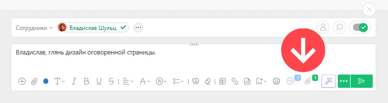

Да, вы можете добавлять в одном [ комментарии](Действия__(комментарии_.md) "Действия \(комментарии\)") сразу несколько опций: прикреплять файлы, добавлять аналитику, список работающих над задачей сотрудников и т.д. 

 _Изображение может отличаться в зависимости от выбранного[вида отображения](Лента_комментариев_задачи.md "Лента комментариев задачи") комментариев._
