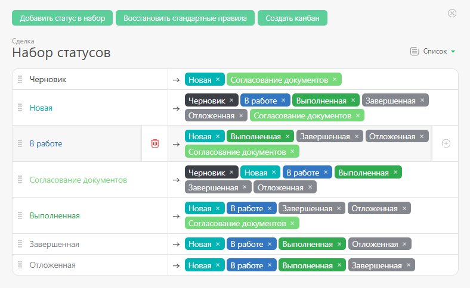
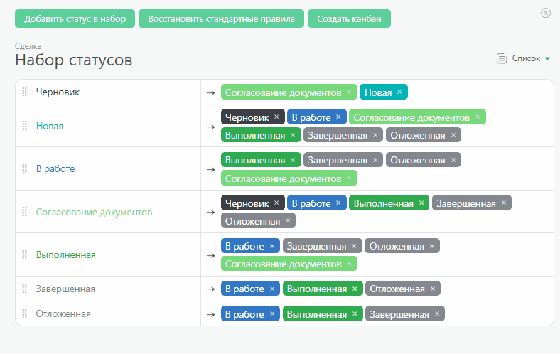
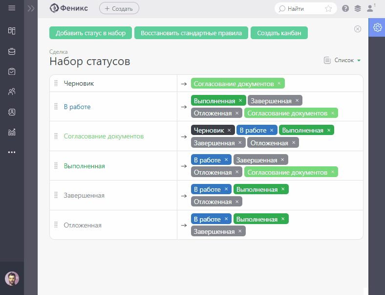

Набор статусов в [Объектах](Объекты.md "Объекты") определяет жизненный цикл задач: в каком статусе они могут быть, какие правила перехода из статуса в статус. При создании Объекта в набор автоматически добавляются стандартные статусы ПланФикса. 

## Добавление нового статуса

Новый статус добавляется в Объекте в разделе "Набор статусов" следующим образом: 

  * Нажмите кнопку «Добавить статус в набор».

  * Если в вашем аккаунте уже есть нужный статус, выберите его из списка.

  * Если нужного статуса нет, нажмите «Плюс» и создайте новый.

  * Выберите статусы, из которых можно будет переходить в добавленный статус.

  * Выберите статусы, в которые можно будет переходить из добавленного статуса.

## Удаление статуса

Для удаления статуса из набора нажмите соответствующую иконку корзины: 

  

Обратите внимание, статус удалится только из набора статусов Объекта и останется в аккаунте. Полностью удалить статус из аккаунта можно в разделе Управление аккаунтом — Статусы. 

## Настройка правил перехода между статусами

Для добавления перехода нажмите Плюс: 

  

## Дополнительные параметры статусов

Клик по статусу откроет меню дополнительных настроек: 

  

В дополнительных настройках можно: 

  * Определить, кто имеет право на перевод в текущий статус.

  * Добавить отдельную кнопку для статуса.

  * Добавить автоматический сценарий.

  * Удалить переход в текущий статус.

  

## Важно

  * Как правило, задача может быть в любой момент отменена или завершена. Чтобы поддержать это поведение, добавляйте для каждого статуса переходы в статусы "Отмененная" и "Завершенная".

  * Во многих случаях задача может быть возвращена на предыдущий шаг. Заранее продумайте все возможные варианты перехода задачи из статуса в статус.
