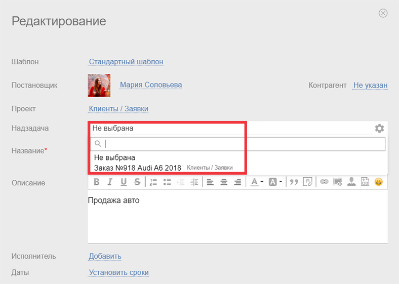
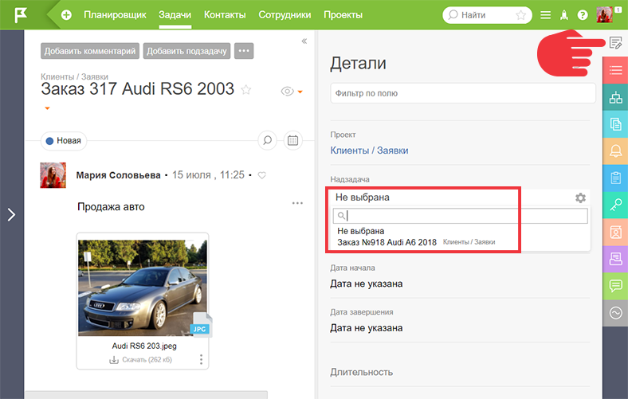
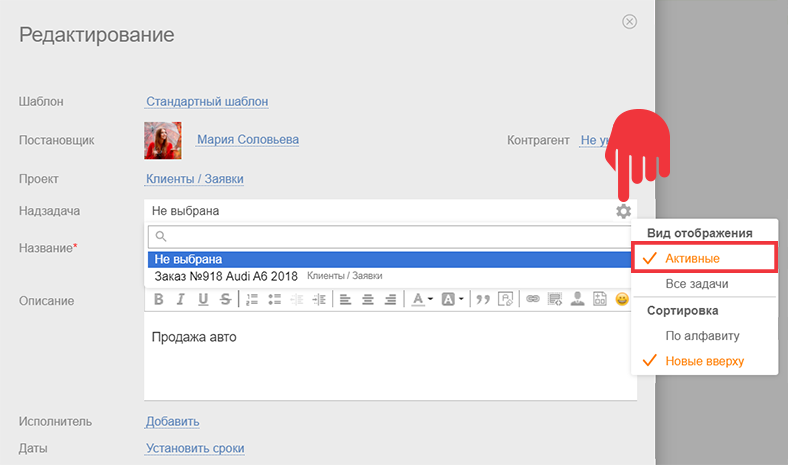
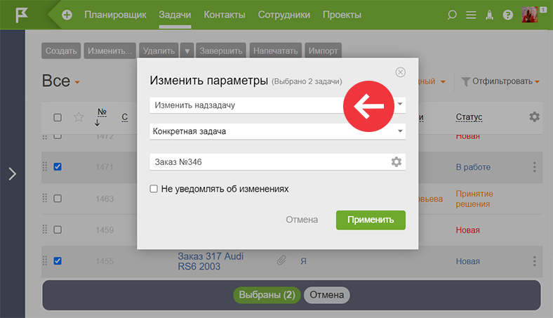

ПланФикс поддерживает вложенность [ задач](Задачи.md "Задачи"). Любую существующую задачу можно сделать надзадачей другой задачи. Назначить или изменить надзадачу в уже существующей задаче можно разными способами: 

  * в режиме редактирования задачи:

  

  * во вкладке «Детали» задачи:

  

## Обратите внимание

При назначении надзадачи ручным способом действует следующее правило — надзадача и подзадача должны находиться в одном проекте. В случае, если в проекте задача, которую нужно указать как надзадачу, находится в неактивном статусе, необходимо переключиться на вид отображения «Активные» задачи следующим образом: 

  

  * [массовым действием](Массовые_операции_над_задачами.md "Массовые операции над задачами") над задачами:

